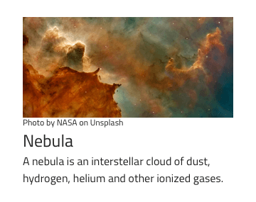
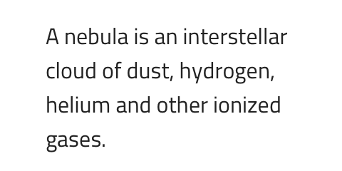
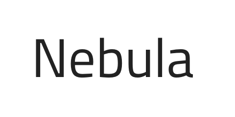
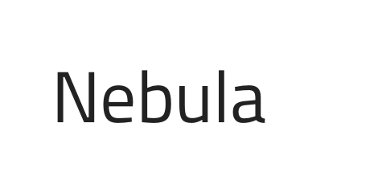
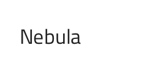
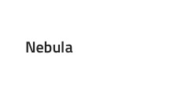
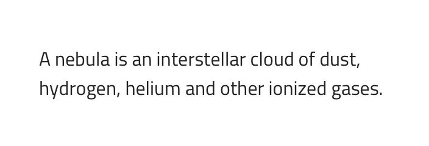
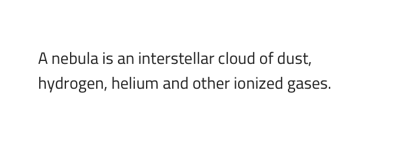
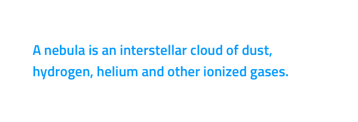

## Text

Use the Text Component Symbol to display the content of a title or paragraph string that is not interactive, such as the content of a news article or blog post.

### Text Demo

### Title and Paragraph

Text comes in two distict variants for Titles and for Paragraphs.

### Title Sizes

Text Titles come in six preset sizes from the largest H1 to the much smaller **H5** and H6.

After inserting a Title, make sure to give it a correct height for the chosen size.
| Size | Pixel Height |
| -- | ----- |
| H1 | 170px |
| H2 | 85px |
| H3 | 68px |
| H4 | 42px |
| H5 | 36px |
| H6 | 31px |

### Paragraph Sizes

Text Paragraphs come in three preset sizes: a larger **Body 1**, a smaller Body 2, and a tiny Caption used to annotate images and titles.

After inserting a Paragraph, make sure to give it a correct height for the chosen size and according to the length of the text content. If the Paragraph spans multiple lines of text multiply the value from the table below with the number of lines you have.
| Size | Pixel Height |
| ------- | ------------ |
| Body 1 | 24px |
| Body 2 | 21px |
| Caption | 19px |

### Styling

Titles and Paragraphs come with constrained styling flexibility, allowing only to choose from the text weight and color presets available in the Typography portion of the Styling library.

## Usage

Always choose Paragraph text color that makes a Hyperlink stand out if the two are used together. Avoid using the same color or similar nuances of it and pick consistent Title and Paragraph colors across your complete design. Use the Paragraph Caption size only for one-line annotations and avoid using such tiny font sizes for longer, multi-line strings.

| Do                                                                         | Don't                                                                          |
| -------------------------------------------------------------------------- | ------------------------------------------------------------------------------ |
|  |  |
|  |  |

## Code generation

This section describes some important overrides and how they affect code generation.

> [!WARNING]
> Triggering `Detach from Symbol` on an instance of the Title or Paragraph Text in your design is very likely to result in loss of code generation capability for the Title or Paragraph Text. For code generation to be able to match your layout in Sketch, make sure that your Titles and Paragraphs have a proper height that is just as much as the content needs to render.

### Text

The Text property may contain text, [binding text](../codegen/data-binding.md), or a combination of the two, examples:

- Settings
- {settingsLabel}
- Important {labelText}

## Additional Resources

Related topic:

- [Data Binding](../codegen/data-binding.md)
  

Our community is active and always welcoming to new ideas.

