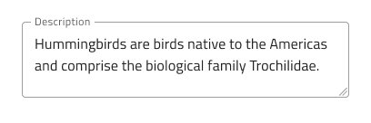
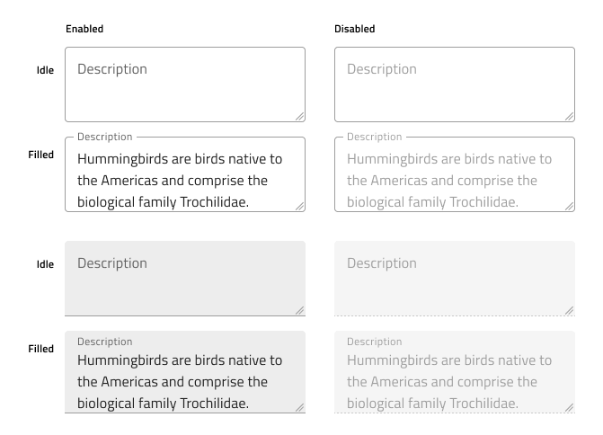
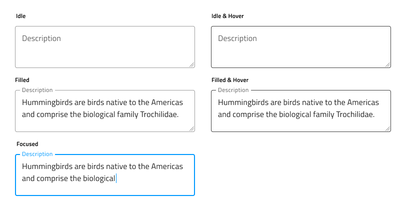
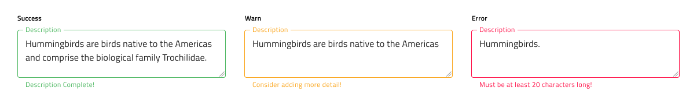

# Text Area

Use the Text Area Component to let the user input long text data displayed in multiple lines and edit it. The Text Area allows the user to resize the area horizontally and vertically by a drag indicator. Users can achieve the Text Area Component by making an [Ignite UI for Angular Input Group Component](https://www.infragistics.com/products/ignite-ui-angular/angular/components/input_group.html) decorated as a text area.

## Text Area Demo

## Size

The Text Area comes in three different sizes:

- Large
- Medium
- Small

| Large | Medium | Small |
| ------- | ------- | ------- |
|  |  |  |

## Types
In Figma we offer choice between two distinct types: border style and box style.

| Border | Box|
| ------- | ------- |
|  |  |

## Interaction State

In Figma, both border and box type Text Area can be set to a Disabled state using the properties panel.

 

## State

The Text Area component supports five states for the enabled variants: Idle, Idle & Hover, Filled, Filled & Hover and Focused. These flexibility enhancements afford a more dynamic interaction design that can seamlessly flow into high-fidelity prototyping. In Figma, you can toggle between states using the `State` property in the right properties panel.

 

Every experienced designer uses constraints wisely to limit the user input and avoid invalid states, hence the availability of validation styles. Through the available validation styles, the Text Area is equipped for sophisticated designs that display Success, Warning, and Error visuals.

 

In Figma, states can be easily switched from the `State` property on the right properties panel.

## Styling

The Text Area comes with styling flexibility through the colors of its Background, Drag Indicator, Border, and Text. To change the validation styles, it is recommended to update the respective color styles in the Indigo.Design library. 

## Usage

When using the Text Area, you should always have a label. A text area without a label appears unclear.

| Do                                                                           | Don't                                                                            |
| ---------------------------------------------------------------------------- | -------------------------------------------------------------------------------- |
|  |  |

## Additional Resources

Related topics:

- [Input](input.md)
  

Our community is active and always welcoming to new ideas.
