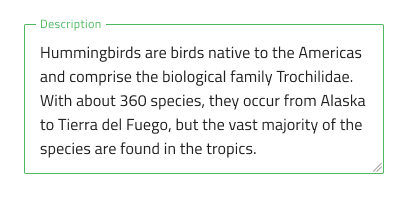
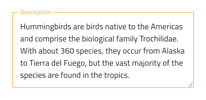
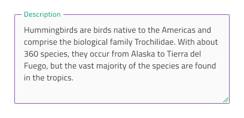

# Text Area

Use the Text Area Component to let the user input long text data displayed in multiple lines and edit it. The Text Area allows the user to resize the area horizontally and vertically by a drag indicator. Users can achieve the Text Area Component by making an [Ignite UI for Angular Input Group Component](https://www.infragistics.com/products/ignite-ui-angular/angular/components/input_group.html) decorated as a text area.

## Text Area Demo

## Interaction State

The Text Area can be inserted in an enabled or disabled state.

## State

When the user interacts with the Text Area, it goes through various states: **idle** with a placeholder in the place of the content, focused while the user is typing in it, and filled once the user has finished adding content and moved on. These flexibility enhancements afford a more dynamic interaction design that can seamlessly flow into high-fidelity prototyping.

`idle`

`focused`

`filled`

Every experienced designer uses constraints wisely to limit the user input and avoid invalid states, hence the availability of validation styles. Through the available validation styles, the Text Area is equipped for sophisticated designs that display success, warning, and error visuals.

In Sketch, the states and validation states are achieved with `Symbol Overrides`, while in Adobe XD we are using the `Component States` paradigm to let you easily switch between them.

## Resizing

The Text Area lets the user resize the area horizontally and vertically by a drag indicator located in the bottom right corner while adjusting text automatically to fit the new constraints.

## Styling

The Text Area comes with styling flexibility through the colors of its background, drag indicator, border, and text. To change the validation styles, it is recommended to update the respective color variables in the Indigo.Design library. 

## Usage

When using the Text Area, you should always have a label. A text area without a label appears unclear.

| Do                                                                           | Don't                                                                            |
| ---------------------------------------------------------------------------- | -------------------------------------------------------------------------------- |
|  |  |

## Additional Resources

Related topics:

- [Input](input.md)
  

Our community is active and always welcoming to new ideas.
