# Time Picker

Use the Time Picker Component to represent a date's time portion (hours and minutes) visually and provide appropriate means for its display in forms and selection from a drop-down or dialog. The Time Picker is visually identical to the [Ignite UI for Angular Time Picker Component](https://www.infragistics.com/products/ignite-ui-angular/angular/components/time_picker.html)

## Time Picker Demo

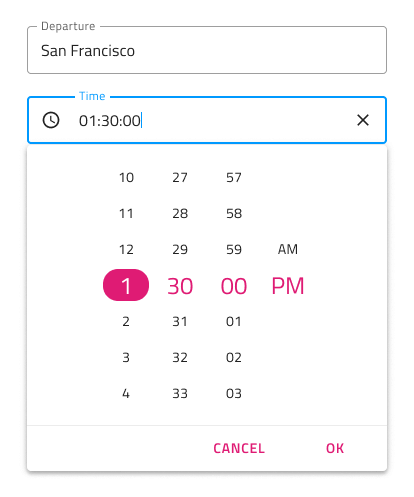

## Time Picker Input

You may insert a Time Picker Input in your forms to indicate fields for selecting just the time portion of the date. It supports Enabled and Disabled interactive states, as well as variant for Dialog and Drop-down that will be shown upon user interaction.

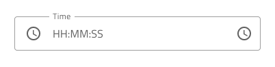
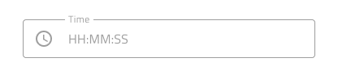

## Picker Layout

The Time Picker supports Dialog layout with Horizontal and Vertical orientation, as well as a Drop-down layout to facilitate different modes of picking time. Notice that Dialog layouts come with a Header that you may hide by setting its override to ~No Symbol, but still the shadow it casts allows to distinguish it from a Drop-down layout.

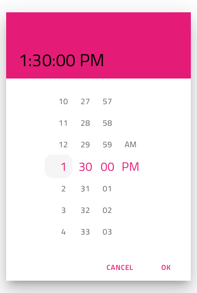         
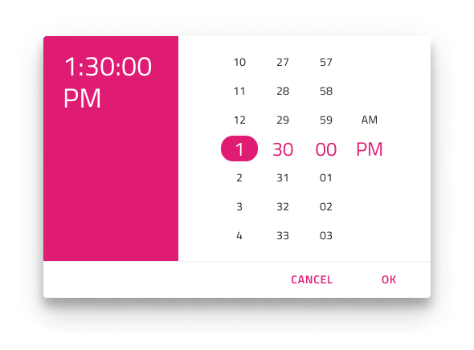

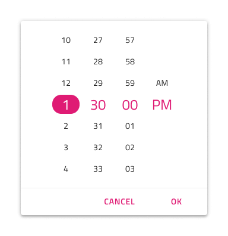

## Content

The Time Picker supports 12 and 24 hour formats through two distinct content modes. Besides the hour and minute portion, the 12-hour content mode provides a meridiem portion, where selection between AM and PM is possible.

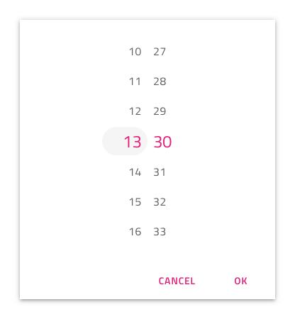

## Buttons

The Time Picker comes with two buttons: one for canceling the selection, which would revert the time to the original one, and one for confirming the selection, which would save the changes made. The Button area is templatable allowing you, for example, to hide a button by setting its override to ~No Symbol, or assign a different action to it.

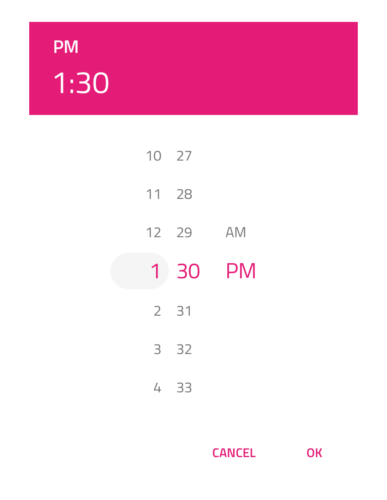

## Styling

The Time Picker comes with styling flexibility through the various overrides controlling header background and title colors, as well as text colors for the selected hour, minute, and meridiem (AM/PM). The Cancel and OK buttons are Flat Buttons and can be styled accordingly.

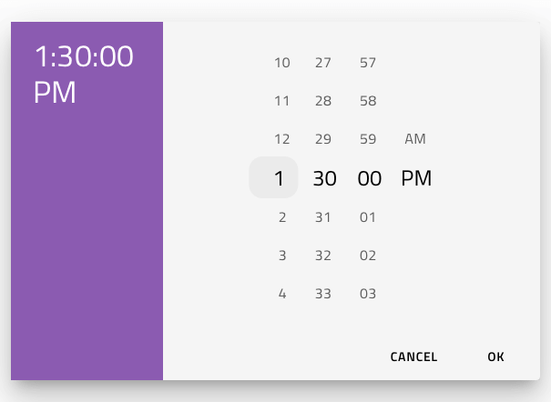

## Usage

When showing Time Picker as a Dialog add a layer that dims the rest of the UI, and when showing it as a Drop-down position it just below a Time Picker Input with Drop-down configuration. Avoid hiding all buttons of the Time Picker when shown as a Dialog because not having an affirmative action hurts usability of the component.

| Do                                                                                     | Don't                                                                                      |
| -------------------------------------------------------------------------------------- | ------------------------------------------------------------------------------------------ |
|  | 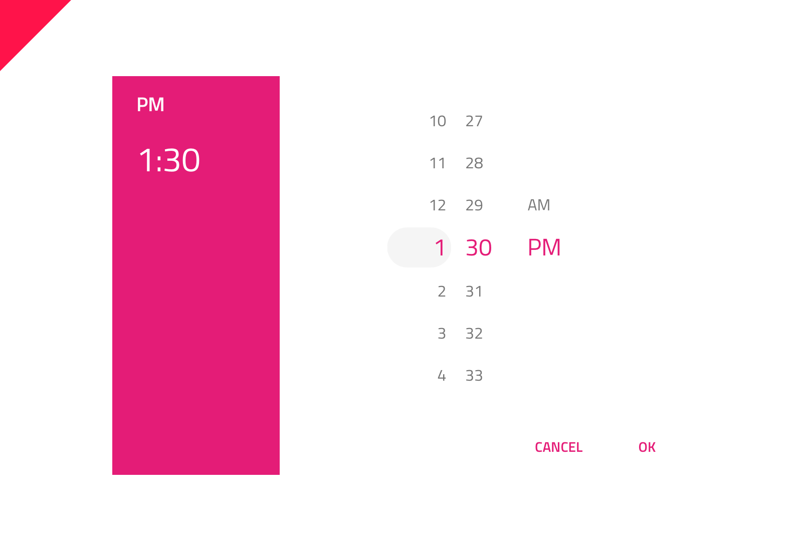 |
| 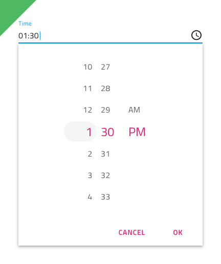 | 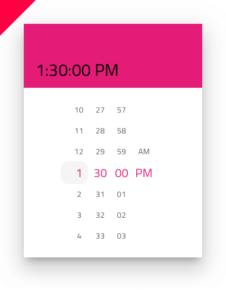 |
| 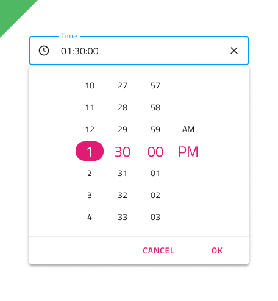 | 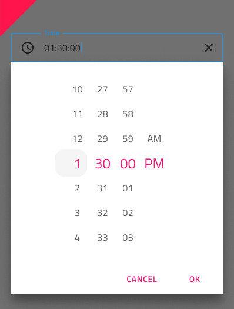 |

## Additional Resources

Related topics:

- [Calendar](calendar.md)
- [Date Picker](date-picker.md)
- [Input](input.md)
- [Form Pattern](../patterns/form.md)
  

Our community is active and always welcoming to new ideas.

