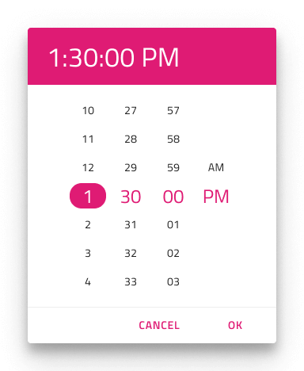
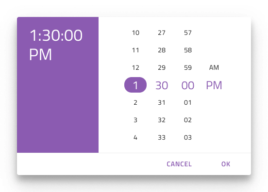
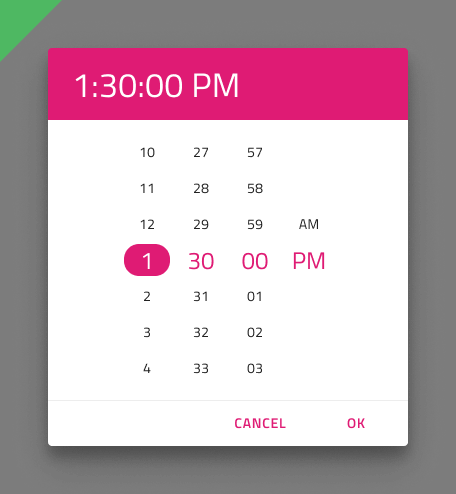
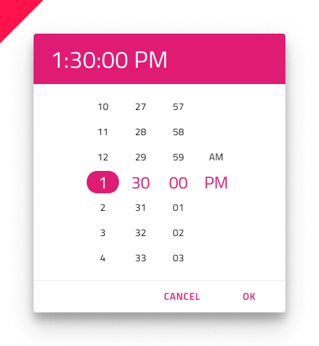

## Time Picker

Use the Time Picker Component Symbol to represent a date's time portion (hours and minutes) visually and provide consistent means for its selection (time picking). The Time Picker is also appropriate for picking and setting time values in accordingly formatted date fields used in various forms.
The Time Picker is visually identical to the [Ignite UI for Angular Time Picker Component](https://www.infragistics.com/products/ignite-ui-angular/angular/components/time_picker.html)

### Time Picker Demo

### Layout

The Time Picker supports Horizontal and Vertical time picking modes.

### Buttons

The Time Picker comes with two buttons: for canceling the selection, which would revert the time to the original one, and for confirming the selection, which would save the changes made. Upon setting both to none through the Overrides a buttonless layout can be achieved.

### Content

The Time Picker supports both 12 and 24 hour formats through two distinct content modes. Besides the hour and minute portion, the 12-hour content mode provides a meridiem portion, where selection between AM and PM is possible.

### Styling

The Time Picker comes with styling flexibility through the various overrides controling header background and title colors, as well as text colors for the selected hour, minute and meridiem (AM/PM).
The Cancel and OK buttons are [Flat Buttons](button.md) and can be styled accordingly.

## Usage

Show the Horizontal and Vertical Time Pickers as a dialog that dims the rest of the UI.

| Do                                | Don't                               |
| --------------------------------- | ----------------------------------- |
|  |  |
|  |  |

## Code generation

> [!WARNING]
> Triggering `Detach from Symbol` on an instance of the Bottom Navigation in your design is very likely to result in loss of code generation capability for the Bottom Navigation.

The Bottom Navigation symbol has a special `🕹️DataSource` field in its `Overrides` section. Use the curly braces notation _{notifications.count}_ to provide a reference for code generation to the database property, which should be used as a binding.
The Bottom Navigation symbol has special `🕹️Event` fields, one for each item, in its `Overrides` section. Use the curly braces notation _{???}_ to provide a reference for code generation to the ...

## Additional Resources

Related topics:

* [Calendar](calendar.md)
* [Form Pattern](forms.md)
  

Our community is active and always welcoming to new ideas.

* [Design System **Forums**](https://www.infragistics.com/community/forums/f/ignite-ui-for-angular)
* [Design System **GitHub**](https://github.com/IgniteUI/igniteui-angular)
