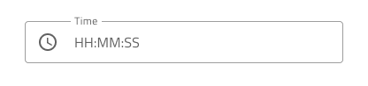
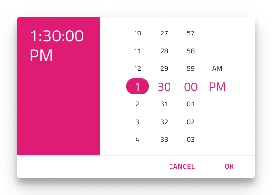

# Time Picker

Use the Time Picker Component to represent a date's time portion (hour, minutes, and seconds) visually and provide appropriate means for its display in forms and selection from a drop-down or dialog. The Time Picker is visually identical to the [Ignite UI for Angular Time Picker Component](https://www.infragistics.com/products/ignite-ui-angular/angular/components/time_picker.html)

## Time Picker Demo

## Time Picker Input

You may insert a Time Picker Input in your forms to indicate fields for selecting just the time portion of the date. It supports Enabled and Disabled interactive states, as well as variant for Dialog and Drop-down that will be shown upon user interaction.

## Picker Layout

The Time Picker supports Dialog layout with Horizontal and Vertical orientation, as well as a Drop-down layout to facilitate different modes of picking time, casting different shadows to be more easily distinguished from each other. Notice that Dialog layouts come with a Header that you may hide in Figma by switching off the boolean `Header` property and the layout will adjust itself accordingly thanks to the added auto layout. In Sketch you can achieve this by setting the Header's override to ~No Symbol, and through the use of a smart layout everything will adjust accordingly. In Adobe XD, you have to delete the header layer and the layout will adjust through the use of a Stack.

         

## Content

The Time Picker supports 12 and 24-hour formats through two distinct content modes. Besides the hour, minutes, and the seconds portion, the 12-hour content mode provides a meridiem portion, where selection between AM and PM is possible. 

## Buttons

The Time Picker comes with two buttons: one for canceling the selection, which would revert the time to the original one, and one for confirming the selection, which would save the changes made. 

The Button area can be templated, making it easy to hide buttons as needed. In Figma, you can simply hide a button by hiding its instance from the layers panel or hide them altogether using the "Action Buttons" boolean property. Similarly, in Sketch, you can set the button's override to ~No Symbol to hide it. In Adobe XD, you can delete unnecessary buttons altogether. Unlike in Sketch and Figma, Adobe XD allows you to add more buttons, e.g. for custom actions, to the Button area from the Libraries panel. Whether you remove or add Buttons, the applied Stack will adjust the layout for you automatically. To add buttons in Figma and Sketch, you should first detach the component instance and then apply the desired changes.

## Styling

The Time Picker comes with styling flexibility through the various options for header background and title colors, as well as text colors for the selected hour, minutes, seconds, and meridiem (AM/PM). The Cancel and OK buttons are [Flat Buttons](button.md) and can be styled accordingly.

## Usage

When showing Time Picker as a Dialog add a layer that dims the rest of the UI, and when showing it as a Drop-down position it just below a Time Picker Input with Drop-down configuration.

| Do                                                                                     | Don't                                                                                      |
| -------------------------------------------------------------------------------------- | ------------------------------------------------------------------------------------------ |
|  |  |
|  |  |

## Additional Resources

Related topics:

- [Calendar](calendar.md)
- [Date Picker](date-picker.md)
- [Input](input.md)
- [Form Pattern](../patterns/form.md)
  

Our community is active and always welcoming to new ideas.
