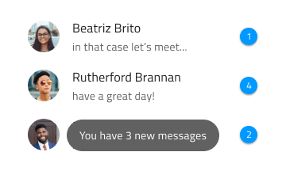
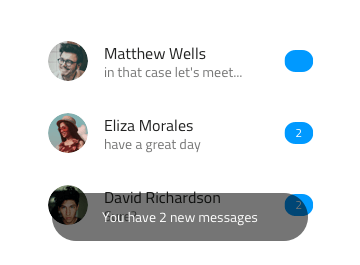
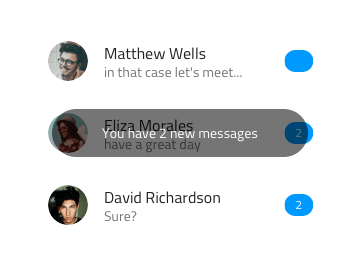
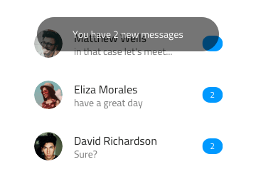
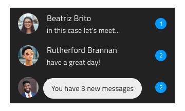
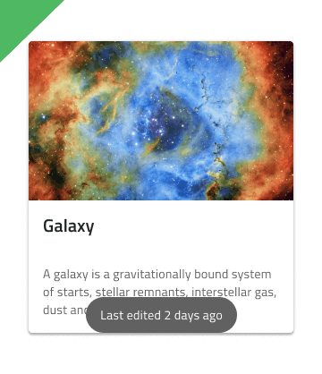
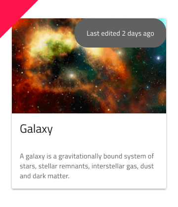
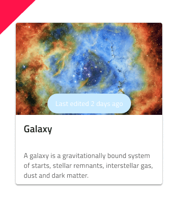

# Toast

Use the Toast Component to show a short information message or notification, which is neither interactive nor possible to dismiss by the user. The Toast should be hidden automatically after a defined time interval. The Toast is visually identical to the [Ignite UI for Angular Toast Component](https://www.infragistics.com/products/ignite-ui-angular/angular/components/toast.html)

## Toast Demo

## Position

The Toast should be relatively positioned towards the bottom, center, or top of the content it notifies about.

## Styling

The Toast comes with styling flexibility through the options available for the background color and message text style. However, it is recommended to use `white` or `active` for the message text, to assure optimal contrast with the background and legibility.

## Usage

The Toast should always be centrally aligned on the horizontal and other placements should be avoided. Approach the Toast styling with care, avoiding too distinct background colors and message text color that is neither white nor dark gray or black.

| Do                           | Don't                          |
| ---------------------------- | ------------------------------ |
|  |  |
|  |  |

## Additional Resources

Our community is active and always welcoming to new ideas.
