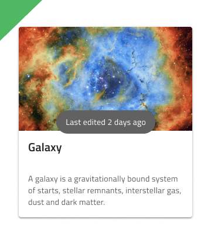

## Toast

Use the Toast Component to show a short information message or notification, which is neither interactive nor possible to dismiss by the user. The Toast should be hidden automatically after a defined time interval. The Toast is visually identical to the [Ignite UI for Angular Toast Component](https://www.infragistics.com/products/ignite-ui-angular/angular/components/toast.html)

### Toast Demo

### Position

The Toast should be relatively positioned towards the bottom, center, or top of the content its information concerns.

### Styling

The Toast comes with constrained styling possibility, allowing only control of the background and message text colors. However, it is highly advisable to choose between `white` and `grays.900` for the message text, whichever of the two gives better contrast with the background.

## Usage

The Toast should always be centrally aligned on the horizontal and other placements should be avoided. Approach the Toast styling with care, avoiding too distinct background colors and message text color that is neither white nor dark gray or black.

| Do                           | Don't                          |
| ---------------------------- | ------------------------------ |
|  |  |
|  |  |

## Code Generation

This section describes some important overrides and how they affect code generation.

> [!WARNING]
> Triggering `Detach from Symbol` on an instance of the Toast in your design is very likely to result in loss of code generation capability for the Toast.

### Data Property

When supplied, the `🕹️DataProperty` value is used to set up a [data binding](../codegen/data-binding.md) to the toast text property. The `🕹️DataProperty` is optional. The `🕹️DataProperty` is the name of the property on the data object specified by the model object name provided during code generation. When supplied, this value overrides the Text property.

### Text

When supplied, the Text property may contain text, [binding text](../codegen/data-binding.md), or a combination of the two, examples:

- Settings
- {settingsLabel}
- Important {labelText}

## Additional Resources

Related topic:

- [Data Binding](../codegen/data-binding.md)
  

Our community is active and always welcoming to new ideas.

