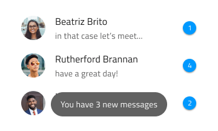

## Toast

Use the Toast Component to show a short information message or notification, which is neither interactive nor possible to dismiss by the user. The Toast should be hidden automatically after a defined time interval. The Toast is visually identical to the [Ignite UI for Angular Toast Component](https://www.infragistics.com/products/ignite-ui-angular/angular/components/toast.html)

### Toast Demo


### Position

The Toast should be relatively positioned towards the bottom, center, or top of the content its information concerns.




### Styling

The Toast comes with constrained styling possibility, allowing only control of the background and message text colors. However, it is highly advisable to choose between `white` and `grays.900` for the message text, whichever of the two gives better contrast with the background.


## Usage

The Toast should always be centrally aligned on the horizontal and other placements should be avoided. Approach the Toast styling with care, avoiding too distinct background colors and message text color that is neither white nor dark gray or black.

| Do                           | Don't                          |
| ---------------------------- | ------------------------------ |
|  |  |
|  |  |

## Code generation

When colors or fonts are specified for the Toast, the Toast HTML element will be wrapped in a div. This is required by browsers to style a nested component (a component within another component).

> [!WARNING]
> Triggering `Detach from Symbol` on an instance of the Toast in your design is very likely to result in loss of code generation capability for the Toast.

### Text/Data Property Binding

There are Text properties for the Message. When supplied, they can be bound to a nested or non-nested data item. If the property is a nested property, include the nested property chain, but don’t include the model object name. Examples:

#### Example Not Nested

```typescript
Customer {
messageText: string;
}
Text would be: { messageText }
```

#### Example Nested

```typescript
Profile {
messageText: number;
}
Customer {
profile: Profile;
}
Text would be: {profile. messageText }
```

## Additional Resources

Related topics:

Our community is active and always welcoming to new ideas.

- [Indigo Design **GitHub**](https://github.com/IgniteUI/design-system-docfx)
