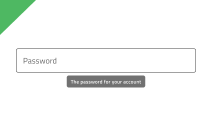

# Tooltip

Use the Tooltip Component to show additional information that describes another component or its purpose in the user interface in a transient way. It becomes visible upon user interaction and may disappear after certain time or upon user interaction. The Tooltip is visually identical to the [Ignite UI for Angular Tooltip Component](https://www.infragistics.com/products/ignite-ui-angular/angular/components/tooltip.html)

## Tooltip Demo

## Styling

The Tooltip comes with styling flexibility through the options available for the background color and message text style. However, it is recommended to use the predefined colors to assure optimal contrast with the background and legibility of the tooltip message.

## Usage

When displaying a Tooltip for a given element, proper positioning is essential. The Tooltip should appear close to the element it describes, without obstructing the interface or distracting the user. Its position should ensure maximum visibility and remain fully within the screen. By default, the Tooltip appears centered just below the element; however, if this placement would cause any part of it to be cut off, it should be repositioned so that the entire Tooltip stays visible.
Tooltips should not be used to convey critical information.

| Do                                                                               | Don't                                                                                |
| -------------------------------------------------------------------------------- | ------------------------------------------------------------------------------------ |
|  |  |
|  |  |
|  |  |

## Additional Resources

Our community is active and always welcoming to new ideas.
