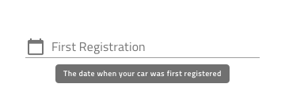
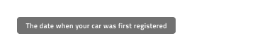
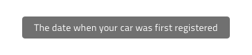
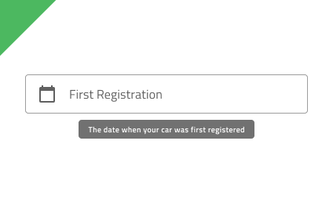
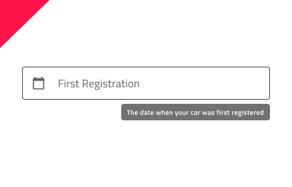
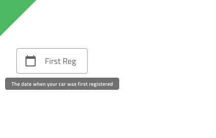
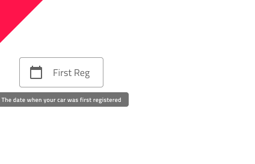

# Tooltip

Use the Tooltip Component to show additional information that describes another component ot its purpose in the user interface in a transient way. It becomes visible upon user interaction and may disappear after certain time or upon user interaction. The Tooltip is visually identical to the [Ignite UI for Angular Tooltip Component](https://www.infragistics.com/products/ignite-ui-angular/angular/components/tooltip.html)

## Tooltip Demo

## Type

The Tooltip comes in appropriate sizing for desktop and mobile usage.

## Variant

The Tooltip has **dark** variant, suiatable for lighter interfaces underneath and a light variant that is more appropriate for usage on top of darker ones.

## Styling

The Tooltip comes with styling flexibility through the overrides controlling its background color.

## Usage

When displaying Tooltip for a given element it is important how the tooltip is positioned. In most cases both element should be centrally aligned in relation to each other. The only exception is when such an alignment would cause part of the Tooltip to be cut out, then the positioning should be such that the whole Tooltip fits in the visible area.

| Do                                                                               | Don't                                                                                |
| -------------------------------------------------------------------------------- | ------------------------------------------------------------------------------------ |
|  |  |
|  |  |

## Code Generation

> [!WARNING]
> Triggering `Detach from Symbol` on an instance of the Tooltip in your design is very likely to result in loss of code generation capability for the Tooltip.

## Additional Resources

Our community is active and always welcoming to new ideas.

