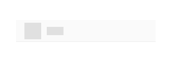

# Skeleton Tree Grid

Use the Skeleton Tree Grid to layout the same type of information that you would in the standard one, but to also indicate an application state when no data is present at the moment e.g. when data is loaded from a remote data source and there is either lack of connectivity, or it takes some time. The Skeleton Tree Grid is just a visual representation of a [Tree Grid](tree-grid.md) with a known layout, but without any data to show.

## Skeleton Tree Grid Demo

## Cell Types

The Skeleton Tree Grid extends the three types of skeleton cells Header, Body, and Summary with an additional one as the standard [Tree Grid](tree-grid.md): TreeColumn cell.

## Cell Size

The Skeleton Tree Grid TreeColumn cell supports the same three size variants as the standard [Tree Grid](tree-grid.md): Large, Medium and Small.

## Cell Depth

The Skeleton Tree Grid TreeColumn cell supports the same visual indication for the level of the data hierarchy as the standard [Tree Grid](tree-grid.md): Root Level, Child Level, or Grandchild Level. To switch between them in Figma once you select a Cell from Column 1 go to the Level base component inside it in the layers panel and use the `Level` property. In Sketch, to switch between them can be achieved with `Symbol Overrides`, while in Adobe XD we are using the `Component States` paradigm.

## Grid Types

The Skeleton Tree Grid supports the three sizes and offers variants for each of them with regard to the state of loading data: Initial which is shown when the Tree Grid is loading data and there are no expanded Root Level rows, and Expand which is shown when a Root Level gets expanded and starts loading data for its children.

## Usage

When creating Tree Grid, avoid combining standard and skeleton cells within the same hierarchy level. Data is either present for all rows and cells on a given level, or for none of them. Combining standard and skeleton cells is appropriate only in a very limited set of use cases such as the presets explained above.

| Do                                                                                                | Don't                                                                                                 |
| ------------------------------------------------------------------------------------------------- | ----------------------------------------------------------------------------------------------------- |
|  |  |

## Additional Resources

Related topics:

- [Tree Grid](tree-grid.md)
  

Our community is active and always welcoming to new ideas.
