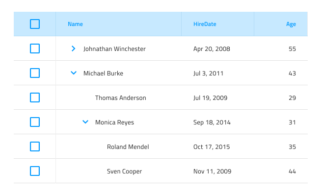

# Tree Grid

Use the Tree Grid Component to let the user browse and interact with a vast amount of hierarchical data that is visually represented in a tabular fashion. It also supports the features available for the [Grid](grid.md). The Tree Grid is visually identical to the [Ignite UI for Angular Tree Grid Component](https://www.infragistics.com/products/ignite-ui-angular/angular/components/treegrid/tree_grid.html)

## Tree Grid Demo

## Detach from Symbol

Similarly to the Grid, the Tree Grid is essentially a repeater of columns and rows showing hierarchical data in a flat, tabular fashion. Therefore, the easiest way to use it is by dragging a `Tree Grid/Comfortable` to your artboard, right-clicking on top of it, and selecting the `Detach from Symbol` option near the bottom of the contextual menu. In your layers panel under the newly appeared group, you should see the following:

| Layer                        | Use                                                                                                                                                  |
| ---------------------------- | ---------------------------------------------------------------------------------------------------------------------------------------------------- |
| 🚫 metadata | A special locked layer starting with a prohibited icon. This layer is required by the code generation and you should avoid deleting or modifying it. |
| Header                       | Contains all the cells in the header                                                                                                                 |
| Body                         | Contains all the cells in the body                                                                                                                   |

After detaching, you may add the number of headers you need to show all the dimensions of your data and as many records as you want to show in your design simply by duplicating one of the existing rows of data.

## Cell Types

The Tree Grid extends the three types of regular Grid cells Header, Body, and Summary with a TreeColumn cell, which is used to create and organize the hierarchy. It is always used as the first Body Cell in every row and comes with a predefined icon and action for collapsing/expanding the row.

To understand how regular Header, Body, and Summary cells can be used for different types of data and configured to enable the various Tree Grid features, please refer to the [general Grid topic](grid.md).

## Cell Display Density

The TreeColumn cell supports three display density variants of the Tree Grid: comfortable, cosy, and compact.

## Cell Depth

The Tree Grid TreeColumn cell provides a visual indication for the level of the data hierarchy via the `Level` override, which can be set to **Root Level**, Child Level or Grandchild Level.

## Styling

The Tree Grid comes with styling flexibility through the options available for the individual cell text, icons, and background colors in the various states available, as well as the hiding of right and bottom borders.

## Usage

Similarly to the Grid, the most important thing about the Tree Grid is the alignment of the data inside its Header and Body Cells. Text should always be aligned left, leaving variable empty space to the right, and numbers should always be aligned right, leaving variable empty space to the left.

| Do                                                                                                | Don't                                                                                                 |
| ------------------------------------------------------------------------------------------------- | ----------------------------------------------------------------------------------------------------- |
|  |  |

## Additional Resources

Related topics:

- [Grid](grid.md)
- [Grid Toolbar](grid-toolbar.md)
- [Grid Export](grid-export.md)
- [Grid Grouping](grid-grouping.md)
- [Grid Column Pinning](grid-column-pinning.md)
- [Grid Column Hiding](grid-column-hiding.md)
- [Grid Column Moving](grid-column-moving.md)
- [Grid Column Resizing](grid-column-resizing.md)
- [Grid Sorting](grid-sorting.md)
- [Grid Row Filter](grid-row-filter.md)
- [Grid Excel Style Filter](grid-excel-style-filter.md)
- [Grid Row Selection](grid-row-selection.md)
- [Grid Editing](grid-editing.md)
- [Grid Display Density](grid-display-density.md)
- [Grid Paging](grid-paging.md)
- [Grid Summaries](grid-summaries.md)
- [Hierarchical Grid](hierarchical-grid.md)
- [Skeleton Tree Grid](tree-grid-skeleton.md)
  

Our community is active and always welcoming to new ideas.
