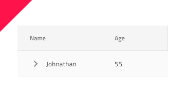

# Tree Grid

Use the Tree Grid Component to let the user browse and interact with a vast amount of hierarchical data visually represented in a tabular layout. It also supports the features available for the [Grid](grid.md). The Tree Grid is visually identical to the [Ignite UI for Angular Tree Grid Component](https://www.infragistics.com/products/ignite-ui-angular/angular/components/treegrid/tree_grid.html)

## Tree Grid Demo

## Using the Tree Grid in Figma and Sketch

Similarly to the Grid, the Tree Grid is essentially a repeater of columns and rows showing hierarchical data in a flat, tabular layout. In Figma, you can easily use it by dragging a `Grid/Tree Grid` (`Tree Grid/Comfortable` in Sketch) component to your frame (artboard in Sketch). To design a Tree Grid with more columns and rows, the component needs to be detached by selecting `Detach Instance` (`Detach from Symbol` in Sketch) option near the bottom of the contextual menu. In your layers panel, you should see the following:

| Layer                        | Use                                                                                                                                                  |
| ---------------------------- | ---------------------------------------------------------------------------------------------------------------------------------------------------- |
| 🚫 componentVersion &nbsp; | A special locked layer starting with a prohibited icon. This layer is required by the code generation and you should avoid deleting or modifying it. |
| 🚫 metadata | A special locked layer starting with a prohibited icon. This layer is required by the code generation and you should avoid deleting or modifying it. |
| Column 1                       | Contains all the cells in the column - Header and Body Cells                                                                                                                |
| ...                            | Columns between Column 1 and Column 7                                             |
| Column 7                       | Contains all the cells in the column - Header and Body Cells                                                                                                                |

After detaching, you may increase the number of columns inside the Tree Grid, by duplicating any of the existing columns. In order to increase the number of body cells, you should use the `Detach instance` option first over the specific column and you should see the following:

| Layer                        | Use                                                                                                                                                  |
| ---------------------------- | ---------------------------------------------------------------------------------------------------------------------------------------------------- |
| 🚫 metadata | A special locked layer starting with a prohibited icon. This layer is required by the code generation and you should avoid deleting or modifying it. |
| Header                      | Contains all the elements related to the Header component                                                                                                              |
| Body Cell 1                       | Contains all the cells in the body                                                                                                                   |
| ...                               | Columns between Body Cell 1 and Body Cell 9                                      |
| Body Cell 9                       | Contains all the cells in the body                                                                                                                   |

Then again by duplicating any of the body cells that already exist inside the column. After you increase or decrease the number of columns or cells, you should manually adjust the size of the Tree Grid Component.

## Using the Tree Grid in Adobe XD

In Adobe XD, after you choose one of the three [preset display density tree grid components](grid-sizes.md) and drag it to your artboard, you will notice in the layers panel that we use `Repeat Grid` for both the Header and the Body to speed configuration up. Unlike in Sketch in Adobe XD destroying the symbol is not necessary. You should see the following in your layers panel:

| Layer                        | Use                                                                                                                                                  |
| ---------------------------- | ---------------------------------------------------------------------------------------------------------------------------------------------------- |
| 🚫 metadata | A special locked layer starting with a prohibited icon. This layer is required by the code generation and you should avoid deleting or modifying it. |
| Header                       | Contains all header cells: the one relating to the TreeColumn body cells and the rest grouped in a Repeat Grid                                                                                                                 |
| Body                         | Contains all body cells: the TreeColumn cells grouped in a Repeat Grid and the rest grouped in another Repeat Grid                                                                                                                  |

When you select a Repeat Grid layer, you may alter the number of the repeated cells you need. Just drag the green handles at the right or bottom edge to show all the dimensions of your data and insert as many visible records as you want to show in your design. To change a particular cell type or column width, you have to select the Repeat Grid layer and click `Ungroup Grid` in the right panel. This will allow you to work the cells separately to achieve the desired design.

## Cell Types

The Tree Grid extends the three types of regular Grid cells Header, Body, and Summary with a TreeColumn cell, which is used to create and organize the hierarchy. It is always used as the first Body Cell in every row and comes with a predefined icon and action for collapsing/expanding the row.

To understand how regular Header, Body, and Summary cells can be used for different types of data and configured to enable the various Tree Grid features, please refer to the [general Grid topic](grid.md).

## Cell Size

The TreeColumn cell supports three size variants of the Tree Grid: Large, Medium and Small.

## Cell Depth

The Tree Grid TreeColumn cell provides a visual indication for the level of the data hierarchy via the `Level` property (override), which can be set to Root Level, Child Level or Grandchild Level. In Figma you can switch between them using the `Level` property once you have selected a Cell from Column 1 and have gone to the Level base component inside it in the layers panel. In Sketch, this can be achieved with `Symbol Overrides`. In Adobe XD we are using the `Component States` paradigm.

## Styling

The Tree Grid comes with styling flexibility through the options available for the individual cell text, icons, and background colors in the various states available, as well as the hiding of right and bottom borders.

## Usage

Similarly to the Grid, the most important thing about the Tree Grid is the alignment of the data inside its Header and Body Cells. Text should always be aligned left, leaving variable empty space to the right, and numbers should always be aligned right, leaving variable empty space to the left.

| Do                                                                                                | Don't                                                                                                 |
| ------------------------------------------------------------------------------------------------- | ----------------------------------------------------------------------------------------------------- |
|  |  |

## Additional Resources

Related topics:

- [Grid](grid.md)
- [Grid Toolbar](grid-toolbar.md)
- [Grid Export](grid-export.md)
- [Grid Grouping](grid-grouping.md)
- [Grid Column Pinning](grid-column-pinning.md)
- [Grid Column Hiding](grid-column-hiding.md)
- [Grid Column Moving](grid-column-moving.md)
- [Grid Column Resizing](grid-column-resizing.md)
- [Grid Sorting](grid-sorting.md)
- [Grid Row Filter](grid-row-filter.md)
- [Grid Excel Style Filter](grid-excel-style-filter.md)
- [Grid Row Selection](grid-row-selection.md)
- [Grid Editing](grid-editing.md)
- [Grid Sizes](grid-sizes.md)
- [Grid Paging](grid-paging.md)
- [Grid Summaries](grid-summaries.md)
- [Hierarchical Grid](hierarchical-grid.md)
- [Skeleton Tree Grid](tree-grid-skeleton.md)
  

Our community is active and always welcoming to new ideas.
