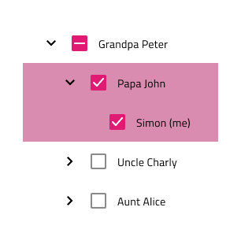

## Tree
The Tree component is used as a visual representation of the hierarchical reletaionship between categories, presented in a list structure.
Tree is visually identical to the [Ignite UI for Angular Tree Component](https://www.infragistics.com/products/ignite-ui-angular/angular/components/tree.html)

## Tree Demo

## Tree Density

The Tree component supports three display densities - Comfortable, Cosy and Compact. In Figma you can switch between the three by changing the value of the "Display Density" property from the properties panel, while in Sketch you need to choose the display density prior to inserting the symbol.

## Tree Type

We support two types of Tree component: Basic and Checkbox, where you have a Checkbox component after the Expand Icon. In Figma you can switch between the two types using the "Checkbox" boolean property from the properties panel, while in Sketch you have to choose the type prior to inserting the symbol, after choosing the display density.

## Tree Node Structure

The Tree component is built from a number of nested components we call Tree Nodes. Each Node consists of Expand Icon and Text. If you've chosen the Checkbox type, there'll also be a Checkbox component after the Expand Icon. 

The Text in each node can be switched from normal to hyperlink text. In Figma this can be achieved by using the "Hyperlink Text" property from the properties panel, while in Sketch this is achieved with `Symbol Overrides`. 

We also support two states of the Expand Icon - Collapsed and Expanded. In Figma you can switch between the two using the "Expand Icon" property from the properties panel, while in Sketch this is achieved with `Symbol Overrides`.

## Tree Node Level

In order to represent the hierarchical releationship between the nodes, the Tree Node supports three Level types: Root, Child and Grandchild. In Figma you can switch to a different level using the "Level" property from the properties panel, while in Sketch this is achieved with `Symbol Overrides`. 

## Tree Node State

The Tree Node comes with the two primary states - Idle and Disabled. You can also choose from a variety of interaction states. In Figma this can be achieved by changing the value of the "State" property from the properties panel, while in Sketch it's achieved with `Symbol Overrides`.

## Tree Presets

In addition to the basic Tree component, you can also choose from three Tree Presets - Active, Cascading Selection and Multiple Selection. These can make building your design easier and faster. In Figma these are separate components, positioned on the same page as the Tree component and you can insert them from the "Assets" panel or the "Resources" panel. In Sketch these are under the Tree folder, in a separate group called "Presets". 

## Styling

The Tree comes with styling flexibility through the available options for the Expand Icon, Checkbox and Text colors, as well as the colors used in different states of the Tree Node.

## Usage

Make sure you switch the state of the Expand Icon to "Expanded" when you have expanded Тree Nodes. If some of the children (but not all) of a Tree Node are selected, make sure to switch the state of the Checkbox of the parent node to indeterminate state.

| Do                                                                             | Don't                                                                              |
| ------------------------------------------------------------------------------ | ---------------------------------------------------------------------------------- |
|  |  |
|  |  |

# Additional Resources

Related topics:

- [Checkbox](../components/checkbox.md)
- [Icon](../components/icon.md)

Our community is active and always welcoming to new ideas.

