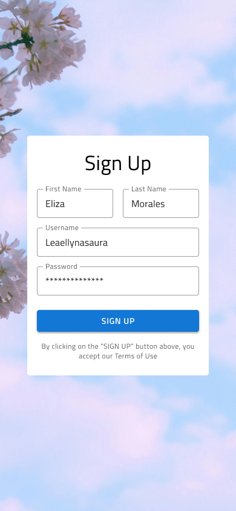
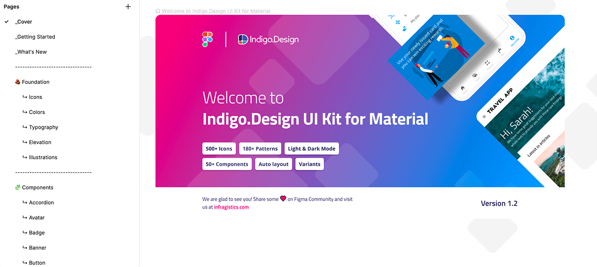
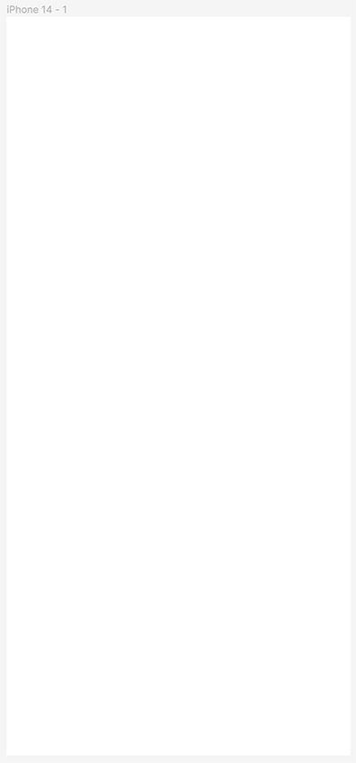
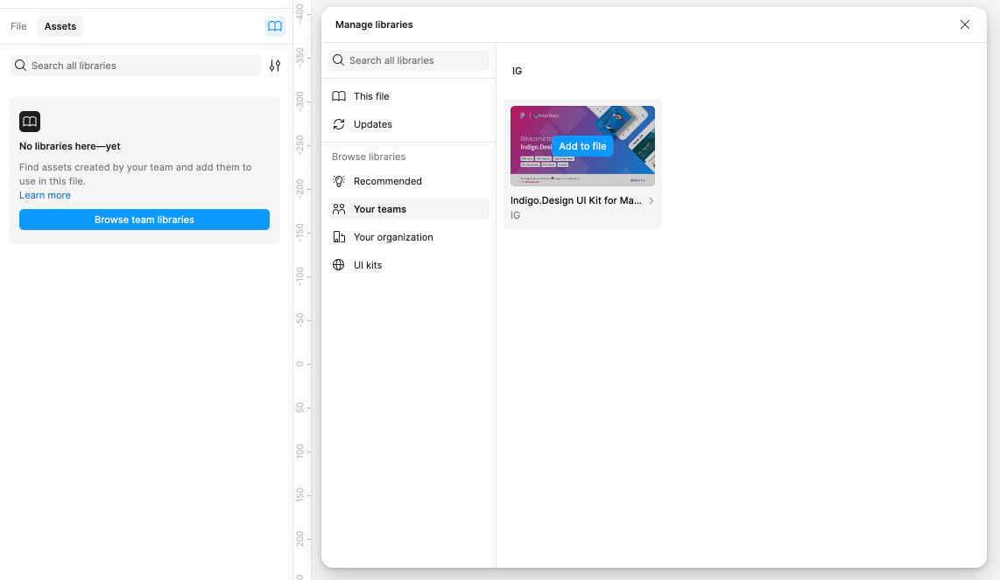
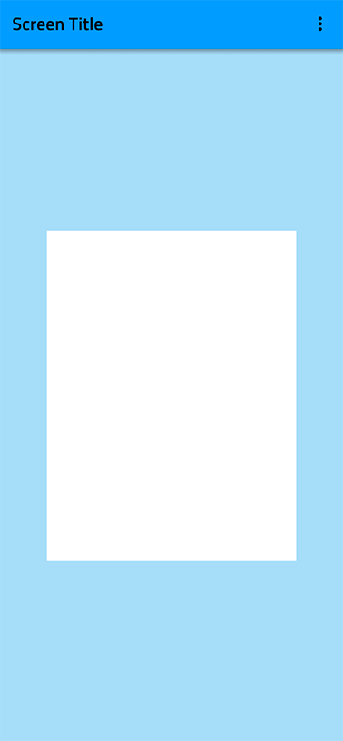
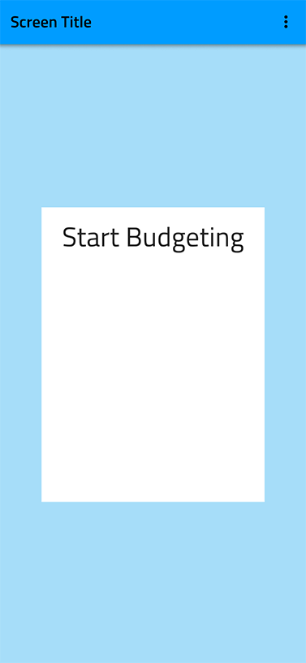
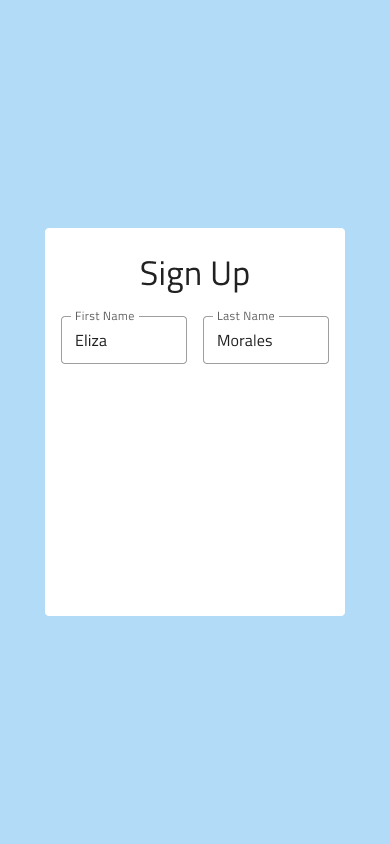
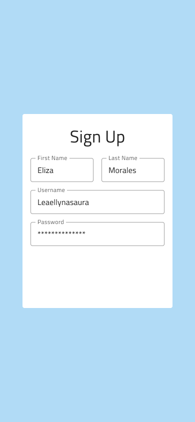
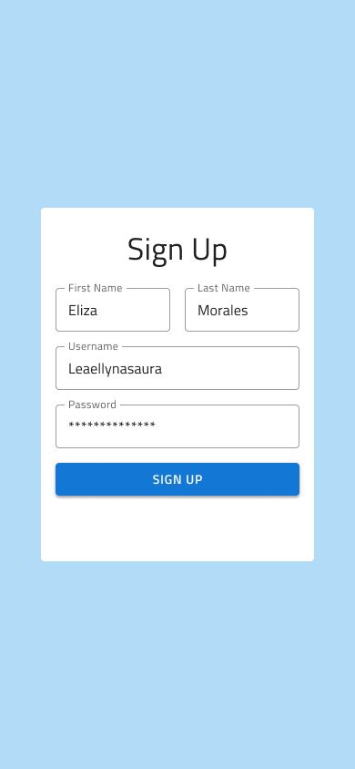

# Creating Your First Frame in Figma

At the end of this topic, you'll have a Figma frame for a registration screen using the **Indigo.Design System**.

## What you need
If the [Titillium Web Font](https://fonts.google.com/specimen/Titillium+Web) isn't installed on your computer, please do it before starting. All texts in the Indigo.Design UI Kit for Material use it.

## Step by step

### 1. Use the **Indigo.Design System** in Figma.

- Get the Indigo.Design UI kit for Material from the Figma community by using the search and click on the "Open in Figma" blue button to duplicate the file. You can download the UI Kit here [here](https://www.figma.com/@infragistics) as well.

The Indigo.Design UI kit comprises pages organized into four sections:

 **Intro section:** This section includes the cover of the Indigo.Design UI kit, a "Getting Started" page that provides a deeper understanding of how the components function and are constructed, and a "What's New" page that serves as a changelog for all releases of the Indigo.Design UI kit.

 **Foundation section:** This section contains all the essential styling assets, including Material Icons, Colors, Typography, Elevation, and Illustrations, organized across five dedicated pages.

 **Components section:** This section features an extensive collection of components for laying out your design ideas. They can be conveniently accessed through the Assets panel [see 3. below](./creating-a-frame-in-figma.md#3-add-and-customize-components) or can be copied directly from this section. Each component comes with various properties that can be customized to fit specific use case scenarios. By utilizing these components and the Indigo.Design Figma Plugin, you can create designs that can be quickly converted into production-ready code for Angular, Blazor, React, or Web Components using the App Builder.

 **Patterns section:** This section features couple of hundred patterns laid out from the components to streamline your app design process.

- Move the Indigo.Design UI kit from “Drafts” to your project. Click on the arrow next to the file’s name and select “Publish library” from the options. In the dialog click the “Publish” button to share the library with your team members within the specific team project space.

### 2. Create a Frame
In Figma go to your project and create a new file. Select the Frame size by clicking on the Frame toolbar button (or by pressing the F key) and select an iPhone 13 & 14 from the panel on the right. This will give you a Frame in the middle in portrait orientation (390x844px).

### 3. Add and customize components 
To incorporate components from the Indigo Design Library and customize them, use the Assets panel on the left and the Properties panel on the right. First, click on the Assets tab, followed by the Team Library button icon. In the newly opened dialog under "Your teams," click on the "Add to file" button to add the Indigo.Design UI kit.

These are the steps to recreate the screen in this example.

#### 1. Add the Background.
The best way to create a background in Figma is to directly apply it to the Fill of the frame. To do this, select the iPhone 13 & 14 frame and go to Fill on the right panel. Click on “Apply styles and variables” icon button and choose Primary/primary.100.

#### 2. Add the background for the form.
1. Press the F key and drag a frame with size 300x388px inside the frame we just created.
2. Choose Special/surface light for the Fill of the frame.
3. Set the Corner radius of the frame to 4px.
4. Position it in the center of the iPhone 13 & 14 frame.

#### 3. Add the title of the form.
1. Press the T key to insert a text element within the white frame and type "Sign Up".
2. Apply the "Heading/H4 Headline" typography style from the Text section in the right panel. Set the alignment to "Center" and position the text at the top of the frame with 24px spacing from the top and equal spacing on the left and right sides. For the text Fill color, select the Grays/Light/grays.900 style.

#### 4. Add the inputs for first and last name.
1. Press Shift + I to open Resources in the Toolbar and search for "Input". Drag it below the form title we just created.
2. In the Properties section in the right panel, under the component's name, select "Filled" for State.
3. Disable the Prefix Container, Suffix Container and Hint options.
4. Set the Label to "First Name" and the Placeholder to "Eliza".
5. Place it below the title. Leave 16px spacing on the left and 24px on the top. 
6. Set its width to 126px.
7. Duplicate this input.
8. Place the new input to the right of the first one, with 16px spacing between the two.
9. Set its Label to “Last Name”, and Placeholder to “Morales”.

#### 5. Add the inputs for username and password.
1. Duplicate one of the Name inputs twice to create two more inputs for Username and Password.
2. Place them one under the other with a vertical spacing of 16px between each other and to the ones from the previous step.
3. Stretch them across the full width with 16px spacing on both sides.
4. Set their labels to "Username" and "Password" and their Placeholders to "Leaellynasaura" and "**************".
5. From the Layers panel select the Content Type component instance of the password input we’ve just created, then go to the component properties in the right panel. From the “Type” property select “Password”.

#### 6. Add the Sign up button.
1. Press Shift + I to open Resources in the Toolbar and search for “Button”.
2. Drag it below the inputs, choose “Contained” from the Type property in the right panel and stretch it across the full width leaving 16px on the left, right, and from the inputs above.
3. Disable the Left Icon and Right Icon from the button’s properties.
4. Set the Label to “SIGN UP” and change the text fill to Special/white style.
5. Set the background to Special/Info/info.500 style.

#### 7. Add the terms acceptance text. 
1. Press the T key to add another text element below the button and type “By clicking on the “SIGN UP” button above, you accept our Terms of Use” in it.
2. Assign the “Other/Caption” style and set the color style to Grays/Light/grays.700.
3. Set the alignment to "Center".
4. Change the text element’s width so that there is a 16px spacing on the left, right and above.

#### 8. Make the frame responsive.
1. Select the "First Name" and "Last Name" input fields and press Shift + A. In the right panel, a new section called "Auto Layout" will appear. Set the Horizontal space between items to 16px if it's not already set. Then, select the two input fields again and change their Horizontal resizing to "Fill container".
2. To make the form responsive, click on the frame containing all form elements and press Shift + A again. If the previous steps were done correctly, the Horizontal padding in the Auto Layout panel should already be set to 16px and the Vertical padding and Vertical gap between objects - to 24px. Align the items to the center and change the horizontal and vertical resizing of the form frame to "Center". Also, change the horizontal resizing of all elements inside to "Fill container".
3. Select the iPhone 13 & 14 frame and press Shift + A again. Choose Fixed width and height for it.
4. Select the form frame again and change its horizontal resizing to "Fill container".

## Additional Resources

Related topics:

- [Styling](style/styling-overview.md)
- [Components](components/components-overview.md)
- [Patterns](patterns/patterns-overview.md)
  

Our community is active and always welcoming to new ideas.
