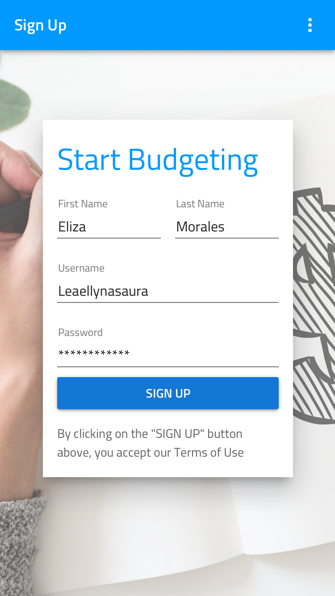
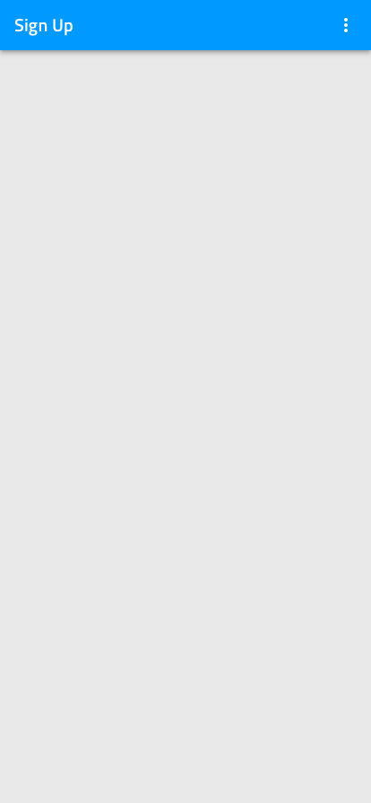
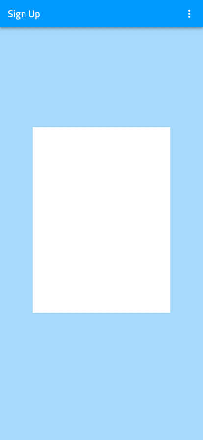
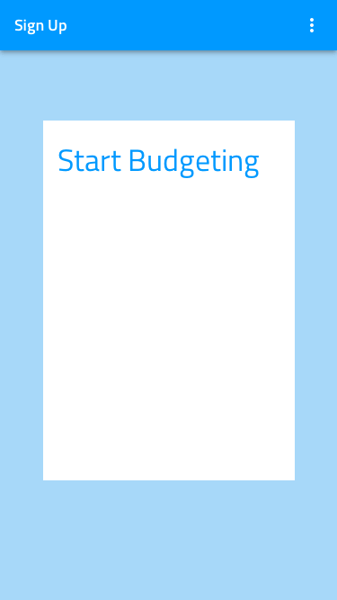
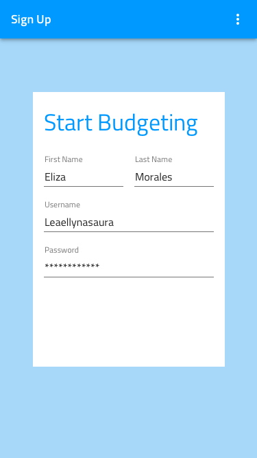
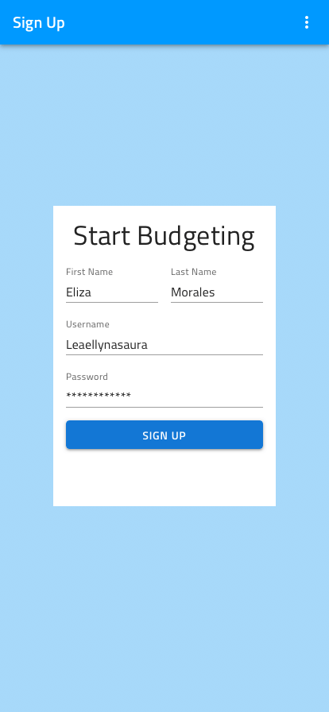

## Creating Your First Artboard

At the end of this topic you'll have a Sketch Artboard for a registration screen using Indigo Design Libraries.

## What you need

If the [Titillium Web Font][1] isn't installed on your computer, please do it before starting. All texts in the Indigo Design Libraries use it.

## Step by step

### 1. Add the Indigo Design Libraries in Sketch.

1.  Download the [Indigo Design Libraries](https://cloud.indigo.design/home).

    It contains 3 Sketch files:

    - **Indigo-Styling**  
      All the styling assets such as Colors, Elevation, Material Icons, and Typography.

    - **Indigo-Components**  
      A vast set of Components to layout your design ideas.  
      Through the overrides section you can choose from numerous presets compatible with Ignite UI for Angular and our code generation engine.

    - **Indigo-Patterns**  
      The library where components shape up meaningful patterns for productive application design.

2.  Open up the Sketch app on your Mac, click on the Sketch item from the Apple Menu, and select Preferences.

  

  
  

  

  

  

  

3.  In the dialog, select the **Libraries** tab and click the **Add Library...** button.

4.  Navigate to the folder where you have the Libraries.

5.  Select all three of them and click **Open**.

6.  Make sure they show up in the list in the **Preferences** dialog and that they all are checked.

If you added the Libraries successfully, they will show up in the **Symbols** section of the **Insert** menu in Sketch.

### 2. Create an artboard.

1.  In the Sketch app on your Mac, create a new file.
2.  Select the Artboard size.  
    Press the A key and select the artboard size from the panel on the right.  
    This example is for an iPhone 8 in portrait orientation (375x667). If you don't see this preset artboard, choose Apple Devices from the dropdown at the top of the panel.

  

  
  

  

  

  

  

### 3. Add and customize components.

You'll use the Insert menu to add components from the Indigo Design library, and then you'll customize them using the panel on the right.

These are the steps to recreate the screen in the example.

1.  **Add the Navbar.**

    1.  From the Insert menu, select Indigo-Components / Navigation / Navbar.
    2.  Place it at the top of the artboard and stretch it to take up all the width available.
    3.  In the Resizing section of the panel on the right, fix its width and its top border to the artboard.
    4.  In the Overrides section, set the Type to ~Title and the Text to "Sign Up".

    

    
    

    

    

    

    

2.  **Add the background color.**  
     Drag a primary.100 color from Styling onto the artboard. Make sure it's below the Navbar in the layers panel on the left and resize it accordingly.

    

    
    

    

    

    

    

3.  **Add the background for the form.**

    1.  From the Insert menu, select Colors/white to add the rectangle.
    2.  Set its size to 280 by 400.
    3.  Place it in the center of the artboard.

    

    
    

    

    

    

    

4.  **Add the title of the form.**

    1.  From the Text Styles at the bottom of the Insert menu, select Indigo-Styling / H4 Headline / Primary Style.
    2.  Place it at the top of the white rectangle, with 16px spacing on the left and top.
    3.  Set the Text to "Start Budgeting" and adjust its width to provide a 16px on the right as well.

    

    
    

    

    

    

    

5.  **Add the inputs for first and last name.**

    1.  From the Insert menu, select Indigo-Components / Inputs / Input / Line.
    2.  Place it below the title. Leave 16px on the left, and 0px from the Title
    3.  Set its width to 116px.
    4.  Duplicate this input.
    5.  Place the new one to the right of the first one, with 16px spacing between the two.
    6.  For both inputs, set the State to ~Dark/Filled.
    7.  Set the Labels to "First Name" and "Last Name", and the Input Texts to "Eliza" and "Morales".

    

    
    

    

    

    

    

6.  **Add the inputs for user name and password.**

    1.  Insert two more Line Inputs.
    2.  Place them one under the other, directly below the ones from the previous step.
    3.  Stretch them across the full width with 16px spacing on both sides.
    4.  Set their State to ~Dark/Filled.
    5.  Set their Labels to "Username" and "Password" and their Input Texts to "Leaellynasaura" and "\*\*\*\*\*\*\*\*\*\*\*\*".

    

    
    

    

    

    

    

7.  **Add the sign up button.**

    1.  From the Insert menu, select Indigo-Components / Buttons / Raised.
    2.  Place it below the inputs, leaving 16px on the left and right, and 0px from the Inputs.
    3.  Set the Background to Colors/info.
    4.  Set the Text to "SIGN UP".

    

    
    

    

    

    

    

8.  **Add the terms acceptance text.**

    1.  From the Text Styles at the bottom of the Insert menu, select Indigo-Styling / Body 2 / Inactive Style.
    2.  Place it below the button.
    3.  Set the Text to "By clicking on the "SIGN UP" button above, you accept our Terms of Use".
    4.  Change its size so that there is a 16px spacing on all sides.

    

    
    

    

    

    

    

9.  **Make the artboard responsive.**
    1.  Select all the layers and group them.
    2.  Select the Group and fix its width and height. Also, fix it to the top from the Resizing options in the panel.

## Additional Resources

Related topics:

- [Button](components/button.md)
- [Input](components/input.md)
- [Navbar](components/navbar.md)
- [Text](components/text.md)
- [Styling](style/styling-overview.md)
  

Our community is active and always welcoming to new ideas.

[a-1]: #1-add-the-indigo-design-libraries-in-sketch
[a-2]: #2-create-an-artboard
[a-3]: #3-add-and-customize-components
[1]: https://fonts.google.com/specimen/Titillium+Web
