# Creating Your First Artboard in Adobe XD

At the end of this topic you'll have an Adobe XD Artboard for a registration screen using the **Indigo.Design System**. If you use Sketch for design then jump to [this topic](creating-artboard-sketch.md).

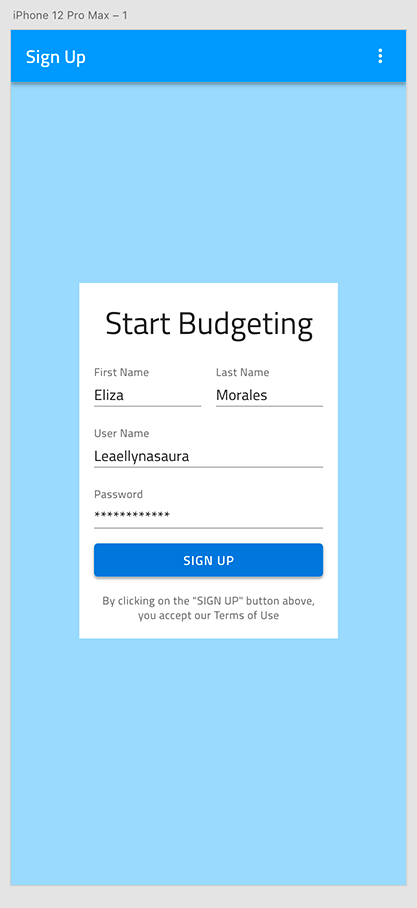

## What you need

If the [Titillium Web Font][1] isn't installed on your computer, please do it before starting. All texts in the **Indigo.Design System** use it.

## Step by step

### 1. Add the **Indigo.Design System** in Adobe XD.

1.  Download the [**Indigo.Design System**](https://cloud.indigo.design/home).

    It contains an Adobe XD file with 63 Artboards organized in three columns:

    - To the left you will find 5 artboards, prefixed with a 🎨 emoji, related to styling. They contain assets such as icons, colors and color palettes, typographies, elevations, and illustrations.

    - In the middle you will find 39 artboards, prefixed with a 🧩 emoji, with more than 50 components to layout your design ideas. Through various presets available as `Components` in Adobe XD and overrides that you can drag and drop over layers in your canvas, e.g. to change the variant of a component from dark to light, you can create layouts compatible with Ignite UI for Angular. Furthermore, through the use of `Component States` and `Stacks` natively supported in Adobe XD you can add a sense of interaction and achieve the degree of templating also available in Ignite UI for Angular.

    - To the right you will find 19 artboards, prefixed with a 🌆 emoji, with a couple of hundred patterns laid out from the components to streamline yout app design process.

2.  Upon toggling the Libraries panel you will notice that all the styles and components outlined above will appear as `Document Assets`.

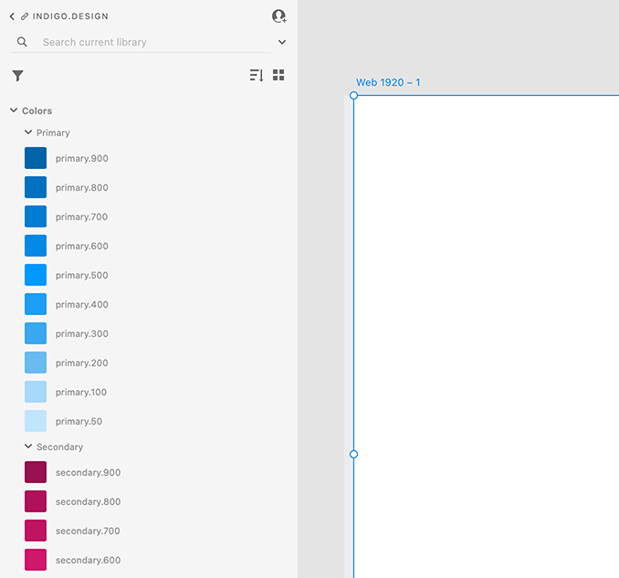

If this is the first time you are using styles and components in Adobe XD, you can switch between `Libraries` and `Layers` from the icon menu at the bottom left of the application.

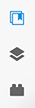

3.  To the right of the `Document Assets` title you will notice an upload-like icon that takes you to the `Publish as a Library` dialog.

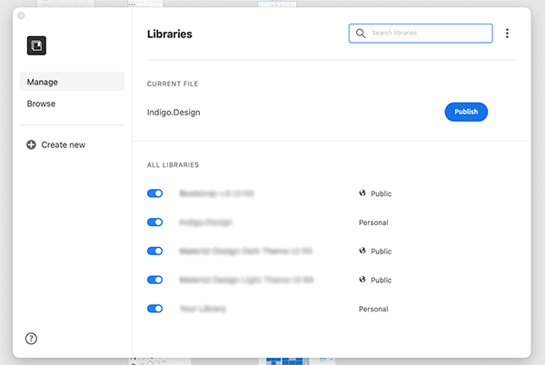

4.  Under `Current File` you will see Indigo.Design and all you need to do is click on the **Publish** button to the right. It takes a while for this process to complete for all the goodies we have prepared for you, but the wait will be totally worth it.

### 2. Create an artboard.

Open Adobe XD and select an iPhone 12 Pro Max. This will give you a new file with one Artboard in the middle in portrait orientation (428x926). Lastly, from the panel on the right you may want to turn on the `Responsive Resize` option that will show you how the Artboard contents behave if it gets resized.

  

  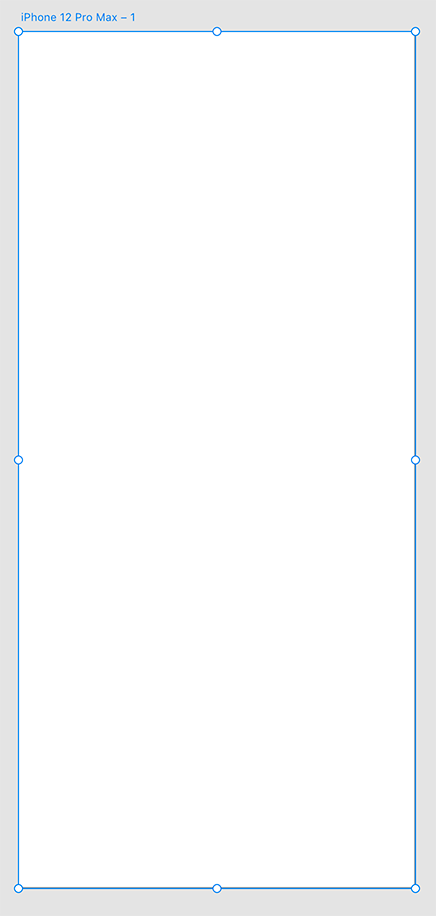
  

  

  

  

  

### 3. Add and customize components.

We will use the `Libraries` panel to add components from the Indigo Design Library. For some of them we will set appropriate States from the panel on the right, and apply `Colors` and `Character Styles` from the `Libraries` panel to customize their appearance. Everytime you create a new file, you have to open the `Libraries` panel and click on the back icon next to `Document Assets` to be able to select Indigo.Design and use it as a library.

These are the steps to recreate the screen in the example.

1.  **Add the Navbar.**

    1.  Use the searchbox in the `Libraries` panel to find the Elevated variant of the Navbar.
    2.  Place it at the top of the artboard and stretch it to take up all the width available.
    3.  Now switch the left panel to show `Layers` and expand the component by clicking on the link icon to the left of its layer name.
    4.  Under Left Group there is another group called Left Action which we will delete and we will do the same for 1 | Icon, 2 | Icon, and 3 | Icon under Right Group.
    5.  Select the Title, hit enter and type in "Sign Up".

    

    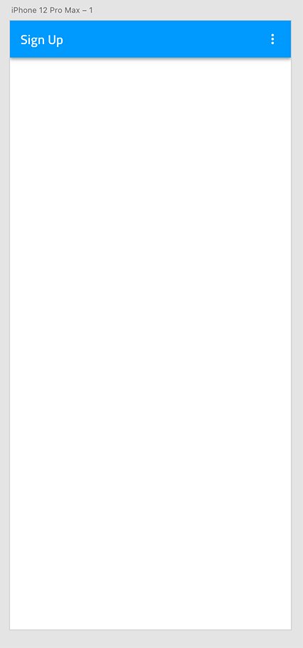
    

    

    

    

    

2.  **Add the background color.**  
     Press the `R` key and drag а rectangular shape, making sure it's sized accordingly to fill the available area below the Navbar and is also under it as a layer. With the rectangle selected change the left panel to show `Libraries` and click the primary.100 color. You will notice that the default outline is still there so we need to untick the `Border` under `Appearance` in the panel on the right.

    

    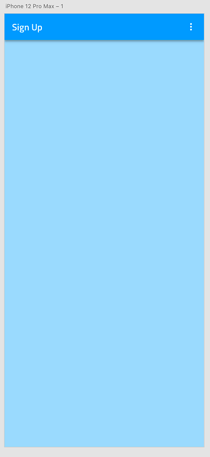
    

    

    

    

    

3.  **Add the background for the form.**

    1.  Press the `R` key again and drag а rectangular shape with size 280x385.
    2.  Remove the border color like we did before and position it in the center of the artboard.

    

    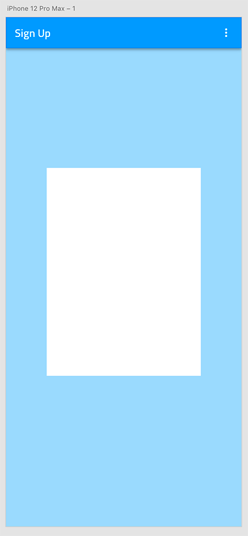
    

    

    

    

    

4.  **Add the title of the form.**

    1.  Press the `T` key to add a text element on top of the white rectangle and type "Start Budgeting" in it.
    2.  With the text layer selected scroll down in the `Libraries` panel to the `Character Styles` and click on Heading H4 - 34pt.
    3.  Place it at the top of the white rectangle, with 16px spacing on the top.

    

    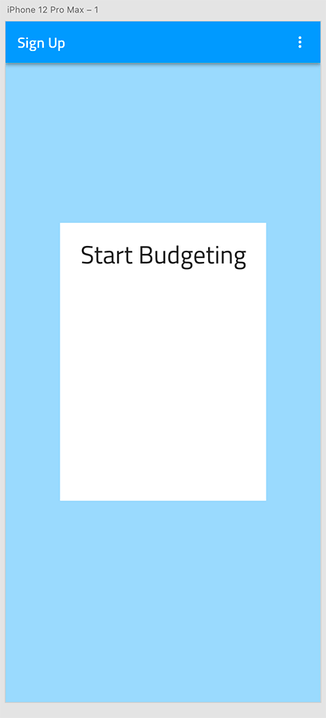
    

    

    

    

    

5.  **Add the inputs for first and last name.**

    1.  Use the searchbox to find the Simple / Line / Enabled variant of the Input. Drag it below the form title, we just created, making sure you pick the right component, not the one prefixed with _Overrides!
    2.  From the `Component (Instance)` section in the right panel select Filled State.
    3.  Expand the layer like we did for the Navbar and delete the Prefix Container and the Suffix Container.
    4.  Set the Label to "First Name", and the Value to "Eliza".
    5.  Place it below the title. Leave 16px on the left and top.
    6.  Set its width to 116px.
    7.  Duplicate this input.
    8.  Place the new one to the right of the first one, with 16px spacing between the two.
    9.  Set its Label to "Last Name", and Value to "Morales".

    

    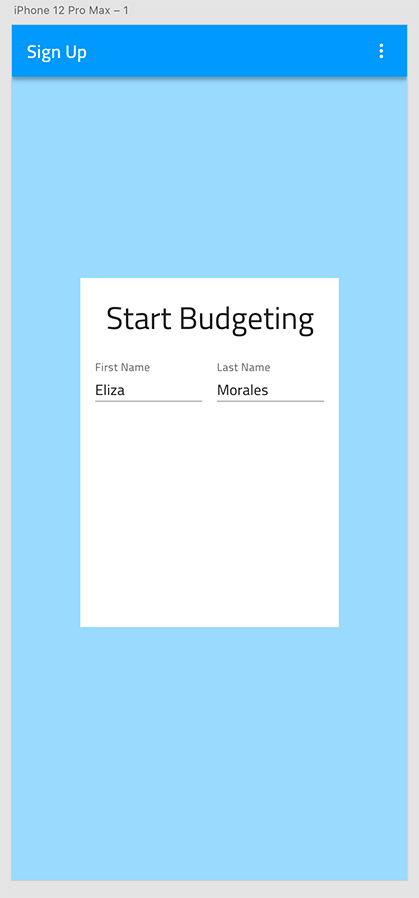
    

    

    

    

    

6.  **Add the inputs for user name and password.**

    1.  Duplicate one of the Name inputs twice to create two more inputs for Username and Password.
    2.  Place them one under the other with a vertical spacing of 16px between each other and to the ones from the previous step.
    3.  Stretch them across the full width with 16px spacing on both sides.
    4.  Set their Labels to "Username" and "Password" and their Values to "Leaellynasaura" and "\*\*\*\*\*\*\*\*\*\*\*\*".
    5.  Select the hidden ContentType layer of the Password input and change its state to Password.

    

    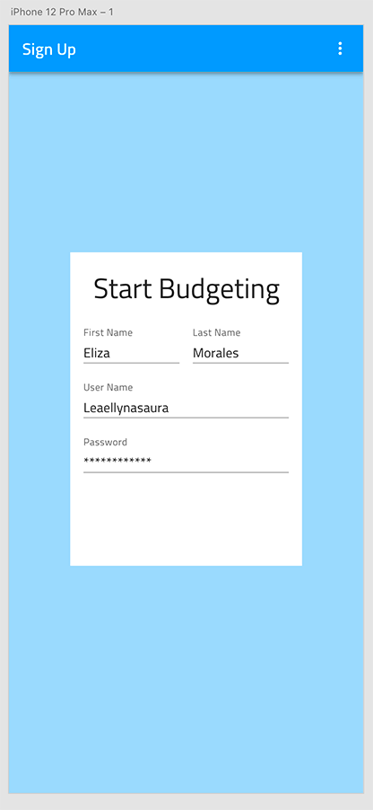
    

    

    

    

    

7.  **Add the sign up button.**

    1.  Change the left panel to `Libraries` and look for a Raised Button.
    2.  Drag it below the inputs, making sure you pick the right component, not the one prefixed with _Overrides, and stretch it across the full width leaving 16px on the left, right, and from the inputs above.
    3.  Switching back to `Layers`, expand the component, delete its icon and set the Label to "SIGN UP".
    4.  Select the Group wrapping the Label and position it in the middle of the Button.
    5.  Switch again to `Libraries` to give the label a surface color and set the Background to info color.

    

    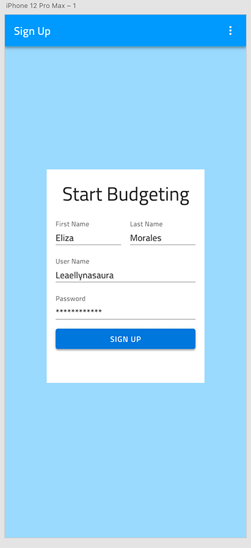
    

    

    

    

    

8.  **Add the terms acceptance text.**

    1.  Press the `T` key to add another text element below the button and type "By clicking on the "SIGN UP" button above, you accept our Terms of Use" in it.
    2.  Assign a Caption - 12pt Character Style to it and give it a grays.700 Color.
    3.  From the right panel set the Text to Auto Height and change the layer size so that there is a 16px spacing on the left, right and above.

    

    
    

    

    

    

    

9.  **Make the artboard responsive.**

Select the text layers, inputs, button and white rectangle, and group them. The automatic Responsive Layout for this group is enough to assure the expected responsive design behavior. 

## Additional Resources

Related topics:

- [Creating Your First Artboard in Sketch](creating-artboard-sketch.md)

- [Button](components/button.md)
- [Input](components/input.md)
- [Navbar](components/navbar.md)
- [Text](components/text.md)
- [Styling](style/styling-overview.md)
  

Our community is active and always welcoming to new ideas.

[1]: https://fonts.google.com/specimen/Titillium+Web
