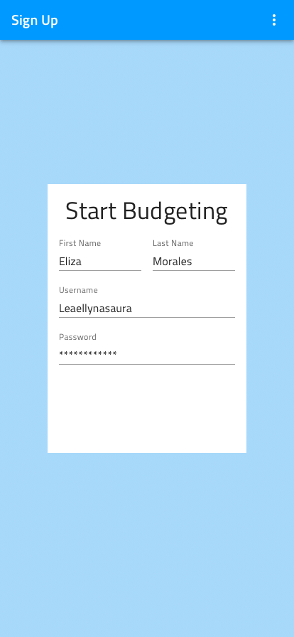
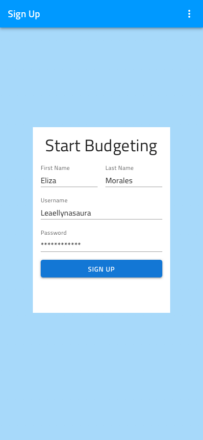

## Getting Started

This topic describes the process of downloading and adding the Indigo Design Libraries into Sketch and how to craft your first design using and customizing the Components necessary for building a registration screen.

### Typeface prerequisites

> [!Note]
> All text in the Indigo Design Libraries is scribed in styles of the [Titillium Web Font](https://fonts.google.com/specimen/Titillium+Web) to match the typeface of [Ignite UI for Angular](https://www.infragistics.com/products/ignite-ui-angular). Before you get in the game with Indigo.Design, you may need to install Titillium Web on your device first and you can do so by following the link above. In the libraries we are using only the `ExtraLight`, `Regular`, and `SemiBold` font weights.

### Downloading and Adding the Libraries in Sketch

First, you will need to [Download the Indigo Design Sketch Libraries](https://cloud.indigo.design/resources) to yours drive. You will get three Sketch files:

- Indigo-Styling - the library with all the styling assets such as [Colors](style/colors.md), [Elevation](style/elevation.md), [Material Icons](style/material-icons.md), and [Typography](style/typography.md). These will allow you to create your own custom themes and brand your designs in the most pleasing and aesthetic way possible.
- Indigo-Components - the library containing a vast set of Components to layout your intricate design ideas and eventaully, after a few design iterations, generate code assets from. Through the overrides section you can choose from numerous presets compatible with [Ignite UI for Angular](https://www.infragistics.com/products/ignite-ui-angular) and our code generation engine.
- Indigo-Patterns - the library where components shape up meaningful patterns for productive application design. All you need to do, is cherry pick a few layouts and focus on designing a logical user journey and customizing the design to make it more appealing for your audience.

> [!Note]
> If you are part of a larger organization and collaborate with other designers or need to follow a certain company-wide guideline, we would advise you to put the libraries on a shared folder in the cloud, but one that also exists on your local drive and is synced via the could provided application. This will mean that any changes made to the libraries e.g. when you implement your custom company branding that needs to be used consistently across all your digital products, will propagate to everyone, who has access to this folder and has been using the libraries to create amazing experiences.

In order to add the Libraries in Sketch follow these

1.  Open up the Sketch app on your Mac, click on the `Sketch` item from the Apple Menu and select `Preferences`.
2.  In the dialog that appears, select the `Libraries` tab and press the `Add Library...` button at the bottom.
3.  Another dialog will show up, allowing you to navigate to the folder on your local drive, where you have placed the Libraries.
4.  Select all three of them and click `Open`, which will close this second dialog window.
5.  Now that they all show up in the list in the Preferences dialog, make sure that they all are checked and close it .
6.  If the Libraries have been added successfully, they will all show up in the `Symbols` section of the `Insert` menu in Sketch.

### Customization through Overrides

The Indigo.Design UI Kit comes with massive customization flexibility built in. This was achieved in the libraries through the mechanism of nesting `Symbols` that get exposed as `Overrides` in a project consuming a Sketch library. Once you start inserting Indigo.Design Components in your project, you will immediately see the `Overrides` section in the right Sketch panel, just underneath the `Prototyping` section. On the image below you can explore the available overrides for the [Badge](components/badge.md) through which you can change its type from number to icon, or configure the number color and value. There are also dropdowns for selecting the border and background colors, where only valid values are made possible for selection. At the very bottom there are special properties that are used for code generation to create the necessary data bindings in the generated Angular app. Each Component has its own unique properties inside the `Overrides` panel and many of the topics in this help section explain the possible values and provide the necessary guidance on using them.

### Creating your First Indigo Design Artboard

Now that you have added the Indigo Design Libraries, you are all set to start crafting amazing experiences. Our first design will be for a simple registration screen with a Navbar, and a beautiful image for background on top of which we will design a simple form consisting of a little bit of Text, a few Inputs and a Button to submit the user details. So, let's find out what a productivity boost the Indigo Design system brings to the table.

1.  Open up the Sketch app on your Mac and create a new file. Press the `A` key and from the right panel select an artboard size from the panel on the right. In this example we will be using an `iPhone 8` in portrait orientation, which will give us a 375 by 667 artboard to design for. If you don't see this preset artboard, choose `Apple Devices` from the dropdown at the top of the panel.

2.  From the insert menu, select `Indigo-Components`, then `Navigation` and `Navbar` positioning the Navbar at the top of the artboard and stretching it to take up the full witdth available. With the Navbar selected, fix its height and fix it to the left, top, and right from the resizing section in the right panel. Looking at the overrides section below we will change the `Type` to `~Title` and type "Sign Up" for the `Text` override below. Now let's insert from `Indigo-Styling/Colors` an instance of the `primary.100` color, which we will use as a background. It should be positioned below the Navbar in the layers panel on the left and resized to fill up the whole portion of the artboard below the Navbar. The layers should look like this:
    | Layer | Description |
    | ------------------------------ | -------------------------------------------- |
    | iPhone 8 | The artboard |
    | &nbsp;&nbsp; Navigation/Navbar | The Navbar that we have inserted |
    | &nbsp;&nbsp; Colors/primary.100 | The background color |

  

  
  

  

  

  

  

3.  From the insert menu, select `Indigo-Styling`, then `Colors/white` and place the white rectangle on top of the background, sizing it to 280 by 398, and putting it in the exact center of the artboard to serve as a surface on top of which our form will be laid out.

  

  
  

  

  

  

  

4.  From the insert menu, select `Indigo-Components`, then `Text` and `Title` positioning it at the top of this surface with a 16px spacing on the left, top, and right. The newly inserted layer should appear above the surface, but below the Navbar. Set the Size override to H4 and the Style to ~34/left/Primary and for the Text type in "Start Budgeting". The last thing to do with this layer is to set its height to 56px.
    | Layer | Description |
    | ------------------------------ | -------------------------------------------- |
    | iPhone 8 | The artboard |
    | &nbsp;&nbsp; Navigation/Navbar | The Navbar that we have inserted |
    | &nbsp;&nbsp; Text/Title | The form title |
    | &nbsp;&nbsp; Colors/white | The form background |
    | &nbsp;&nbsp; Colors/primary.100 | The background color |

  

  
  

  

  

  

  

5.  From the insert menu, select `Indigo-Components`, then `Inputs/Input` and `Line` positioning it below the title both in the canvas and in the layers panel. Leave 16px on the left, 16px from the Title at the top and set its width to 116px. Now duplicate this input, positioning the second one to the right of the first one, which will provide a 16px spacing between the two and on the right of the second one. Select both Inputs and change the State override to ~Dark/Filled. Then, with the left Input selected provide "First Name" for its label and "Eliza" for the Input Text. Do the same for the right one with "Last Name" and "Morales" and you should get something similar to this:

  

  
  

  

  

  

  

6.  Now, insert two more `Line` Inputs, positioning them one under the other, with 16px vertical spacing. Change their State override to ~Dark/Filled as well and make them stretch across the full width with 16px spacing on both sides. Update the Labels to "Username" and "Password" and Input Texts to "Leaellynasaura" and "\*\*\*\*\*\*\*\*\*\*\*\*" accordingly.
    | Layer | Description |
    | ------------------------------ | -------------------------------------------- |
    | iPhone 8 | The artboard |
    | &nbsp;&nbsp; Navigation/Navbar | The Navbar that we have inserted |
    | &nbsp;&nbsp; Text/Title | The form title |
    | &nbsp;&nbsp; Inputs/Input/Line | The First Name input |
    | &nbsp;&nbsp; Inputs/Input/Line Copy | The Last Name input |
    | &nbsp;&nbsp; Inputs/Input/Line | The Username input |
    | &nbsp;&nbsp; Inputs/Input/Line Copy | The Password input |
    | &nbsp;&nbsp; Colors/white | The form background |
    | &nbsp;&nbsp; Colors/primary.100 | The background color |

  

  
  

  

  

  

  

7.  From the insert menu, select `Indigo-Components`, then `Buttons` and `Raised` positioning the Button below the form we have created. Leave 16px on the left, 16px from the Inputs at the top and 16px on the right. Update the Text to "SIGN UP" and set the Background to Colors/info.

  

  
  

  

  

  

  

8.  From the insert menu, select `Indigo-Components`, then `Text` and `Paragraph` positioning it below the button and changing its size so that there is a 16px spacing on all sides. Set the Size override to Body 2 and the Style to ~14/left/grays.700 and for the Text type in "By clicking on the "SIGN UP" button above, you accept our Terms of Use".
    | Layer | Description |
    | ------------------------------ | -------------------------------------------- |
    | iPhone 8 | The artboard |
    | &nbsp;&nbsp; Navigation/Navbar | The Navbar that we have inserted |
    | &nbsp;&nbsp; Text/Title | The form Title |
    | &nbsp;&nbsp; Inputs/Input/Line | The First Name Input |
    | &nbsp;&nbsp; Inputs/Input/Line Copy | The Last Name Input |
    | &nbsp;&nbsp; Inputs/Input/Line | The Username Input |
    | &nbsp;&nbsp; Inputs/Input/Line Copy | The Password Input |
    | &nbsp;&nbsp; Buttons/Raised | The SIGN UP Button |
    | &nbsp;&nbsp; Text/Paragraph | The terms of use Paragraph |
    | &nbsp;&nbsp; Colors/white | The form background |
    | &nbsp;&nbsp; Colors/primary.100 | The background color |

  

  
  

  

  

  

  

The last thing would be to select all layers for the form, including the white background, and group them together. With the newly formed Group selected fix both its width and height and place it in the center . This will not change the final look of our design, but will make it act responsive if the artboard is resized.

> [!WARNING]
> As you were making progress on the tasks above, you may have spotted the `_Overrides` category, appearing in the insert menu above the various Components and Patterns available. This category contains internal symbols, which we have used to develop the preset states and layouts, through which the amazing flexibility and customization that come with Indigo.Design are possible. Anything that you may see under `_Overrides` is actually available through the component it is intended for, so please ignore this category and restrain yourself from using anything that is inside for your designs.

## Additional Resources

Related topics:

- [Button](components/button.md)
- [Input](components/input.md)
- [Navbar](components/navbar.md)
- [Text](components/text.md)
- [Styling](style/styling-overview.md)
  

Our community is active and always welcoming to new ideas.

