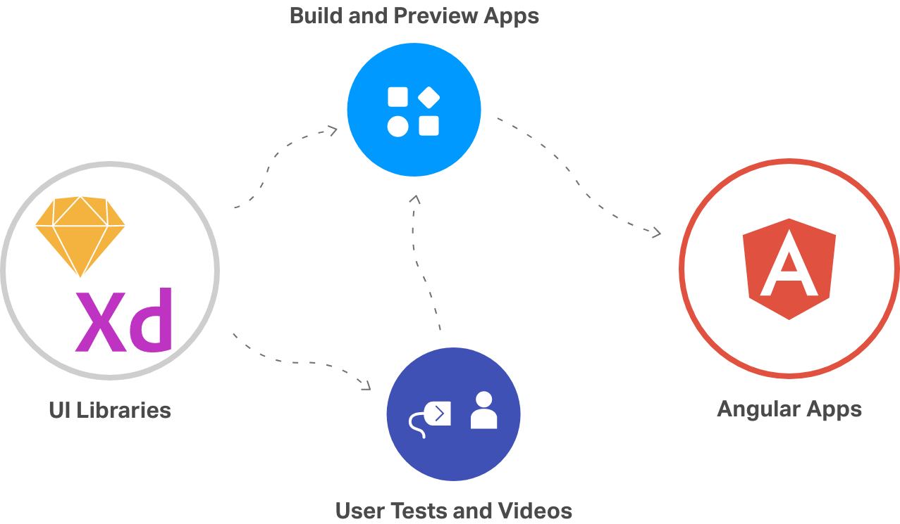

# Getting Started

Indigo.Design is a unified platform for visual design, UX prototyping, code generation and app development. It’s aimed at design and development teams looking to deliver pixel perfect apps as quickly as possible, without losing focus on UX.

> [!NOTE]
><b>Indigo.Design platform consists of three main modules - Prototypes, Usability Studies and App Builder. While Prototypes and Usability Studies help you measure and improve the user experience of a product or feature, the App Builder enables users build their own single page application in a web environment and generate Angular code from it.

## How does this work?

Indigo.Design offers three key capabilities to support the design to development workflow:

1. Create designs in Sketch or Adobe XD with the `Indigo.Design System`
2. Share as prototypes to test and collaborate with users via `cloud.indigo.design`
3. Design your app in `Indigo.Design App Builder` using a Sketch or Adobe XD file or directly using the visual application builder
4. Generate Angular code from your application in the Indigo.Design App Builder, using the its `Code Generation` service. 

### 1. Indigo.Design System

The design system is a set of libraries for Sketch and Adobe XD, containing various assets, styles, components, and patterns. Тhe UI components allow you to create intricate user interfaces providing you with the flexibility to use various states and templates. To customize their appearance you may leverage the pre-made palettes, typographies, shadows, icons, and illustrations. And finally, with the provided collection of patterns, such as product details layouts, various forms, and pricing tables among others, you are able to streamline app design assuring the application of best practices in UI and interaction design.

Indigo.Design for Sketch now offers not one but four library files to its users: one for each of the design languages we support - Material, Bootstrap, Fluent UI, and our very own Indigo. All four libraries support seamless switching between light and dark mode via the [Indigo.Design plugin](sync-themes-plugin.md) and work with any of the predefined or custom color palettes it provides. With this improvement, Sketch users are able to enjoy 100% native look and feel of their components and patterns for the design language of their choice.

If you are brand new to Indigo.Design learn more about how to create your first artboard with it:
* [Create your first Sketch artboard](creating-artboard-sketch.md)
* [Create your first Adobe XD artboard](creating-artboard-adobexd.md)

### 2. Prototyping & Usability Testing

To get feedback on your designs, use cloud.indigo.design to import the Sketch document and share it as an interactive prototype. This will allow your stakeholders to view your prototype on any device and give feedback via comments.

Learn more:

[Create prototypes in the cloud](prototyping/creating-a-prototype.md)

If you want to watch how users use your prototype to complete specific tasks, and also collect metrics like time on task and completion rate, set up a usability test using the published prototype.

Learn more:
[Set up a user test](prototyping/set-up-a-user-test.md)

### 3. Design and generate code from an application in Indigo.Design App Builder

The App Builder module lets you design a single page application using a design file (Sketch or Adobe XD) as a starting point or create it from skratch. The App Builder includes a set of major features, enabling users to use real UI components, global themeing, external data sources.

Learn more:
[Build an application in the App Builder](https://www.infragistics.com/products/appbuilder/docs/app-builder-overview)

### 4. Generate Code for Angular Apps

Once ready with the design of your application in Indigo.Design App Builder, you can easily generate Angular code from it. The generated code can be directly uploaded to a repository in GitHub or downloaded locally as a file package. The components used in the generated application are powered by[Ignite UI for Angular UI framework](https://www.infragistics.com/products/ignite-ui-angular)

Learn more:

- [Generating code from an application in Indigo.Design App Builder](https://www.infragistics.com/products/appbuilder/help/generate-app/generate-app-overview)