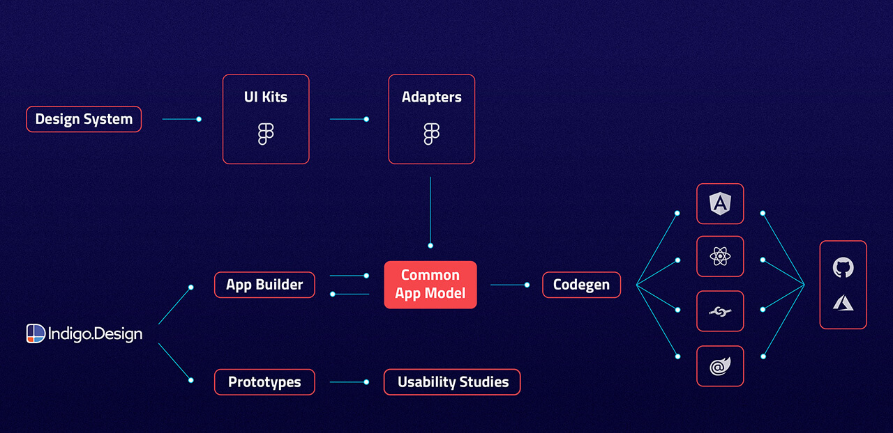
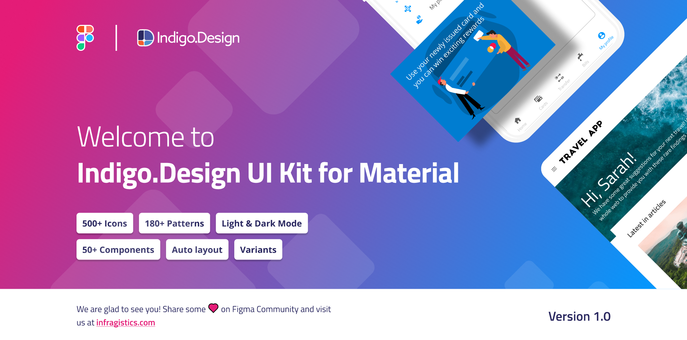
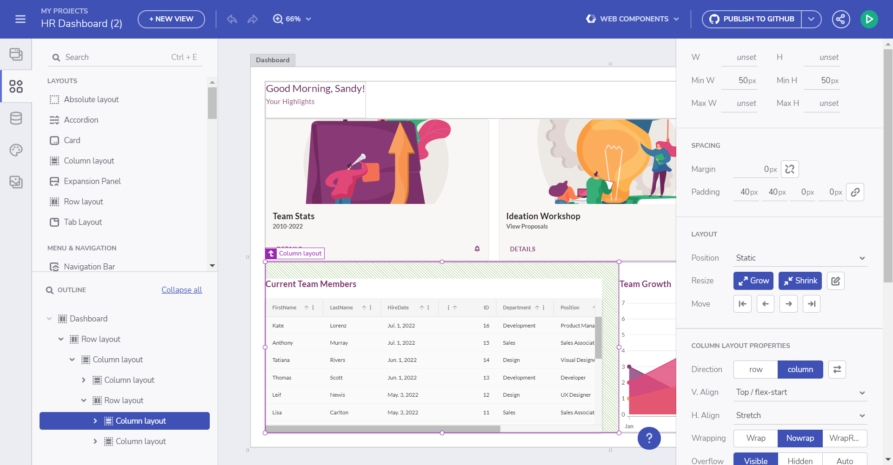
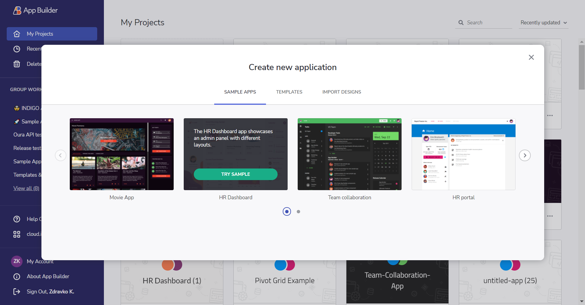

# Getting Started

Indigo.Design is a unified platform for visual design, UX prototyping, code generation and app development. It’s aimed at design and development teams looking to deliver pixel perfect apps as quickly as possible, without losing focus on UX.

Design to development workflow

Indigo.Design platform consists of three main modules - **UI Kits**, **Prototypes/Usability Studies** and **App Builder**. **The UI Kits (Figma)** map to real UI controls and components, with tooling that delivers productivity. Each **UI Kit** implements and follows strictly - Colors, Typography, Sizes and etc. While **Prototypes and Usability Studies** help you measure and improve the user experience of a product or feature. **The App Builder** enables users build their own applications in a web environment and generate **Angular, React, Blazor or Web Components** code from it.

## How does this work?

Indigo.Design offers key capabilities to support the design-to-development workflow:

1. Create designs in Figma with the `Indigo.Design System`
2. Share as prototypes to test and collaborate with users via `cloud.indigo.design`
3. Design your app in `App Builder` using a Figma file and import it via the Plugin or directly use the [App Builder](https://www.appbuilder.dev).
4. Generate Angular, Blazor, React or Web components code from your application in the [App Builder](https://www.appbuilder.dev), using its `Code Generation` service. 

## Indigo.Design System

The design system is a set of libraries for Figma, containing various assets, styles, components, and patterns. Тhe UI components allow you to create intricate user interfaces providing you with the flexibility to use various states and templates. To customize their appearance you may leverage the pre-made palettes, typographies, shadows, icons, and illustrations. And finally, with the provided collection of patterns, such as product details layouts, various forms, and pricing tables among others, you are able to streamline app design assuring the application of best practices in UI and interaction design.

Figma UI Kit for Material

### Figma UI Kits
Our Figma Indigo.Design UI Kits map to our Ignite UI for Angular, Blazor, React and Web Components UI toolset to completely redefine design-development processes. You now get a robust set of components, patterns, styling, and customization options, enabling you to import prototypes or any type of screen designed in Figma and transform it into clean code. The best part is that all static designs become interactive, responsive apps with real UI components, branding, and styling – in a single click.

Figma UI Kit

You can download our Indigo.Design Figma Plugin, Indigo.Design UI kits and sample apps from the [Download Assets page.](https://cloud.indigo.design/resources/figma)

Or through the direct links below:
- [Figma UI Kits](https://www.figma.com/@infragistics)
- [Plugin for Figma](https://www.figma.com/community/plugin/1462024243431691008/indigo-design-figma-plugin) 
- [Sample Apps](https://download.infragistics.com/products/Infragistics/Indigo.Design/Samples/Infragistics_IndigoDesign_Sample_Apps_Figma.zip)

> [!Note]
> There is a difference in functionality when using the UI kits as a free Figma user versus a Pro user. - [topic](https://www.infragistics.com/products/appbuilder/help/ui-kits/figma#using-the-kit-as-a-free-figma-user-vs-pro-user)

## Design apps with App Builder

The App Builder allows you to generate a single-page Figma design file as a starting point or build one from scratch. It offers a range of powerful features, including real UI components, global theming, and integration with external data sources.

Design canvas

Learn more:
- [Build an application in the App Builder - Getting started](https://www.infragistics.com/products/appbuilder/help/getting-started).
- [App Builder interface overview](https://www.infragistics.com/products/appbuilder/help/interface-overview).
- [Flex layouts](https://www.infragistics.com/products/appbuilder/help/flex-layouts/flex-layouts).
- [Components](https://www.infragistics.com/products/appbuilder/help/indigo-design-app-builder-components).
- [Interactions](https://www.infragistics.com/products/appbuilder/help/interactions).
- [SPA and navigation](https://www.infragistics.com/products/appbuilder/help/single-page-apps-and-navigation).
- [Share and preview apps](https://www.infragistics.com/products/appbuilder/help/share-preview-edit-app).

Create app from sample application:

Sample apps

## Generate Code

Once ready with the design of your application in App Builder, you can easily generate Angular, Blazor, React or Web Components code from it. The generated code can be directly uploaded to a repository in GitHub or downloaded locally as a file package. The components used in the generated application are powered by [Ignite UI for Angular UI framework](https://www.infragistics.com/products/ignite-ui-angular)

Learn more:

- [Generating code from an application in App Builder](https://www.infragistics.com/products/appbuilder/help/generate-app/generate-app-overview)
- [Blazor code generation](https://www.infragistics.com/products/appbuilder/help/blazor-support)
- [Web Components code generation](https://www.infragistics.com/products/appbuilder/help/web-components-support)

If you are brand new to Indigo.Design learn more about how to create your first frame with it:
* [Create your first Figma frame](creating-a-frame-in-figma.md)

