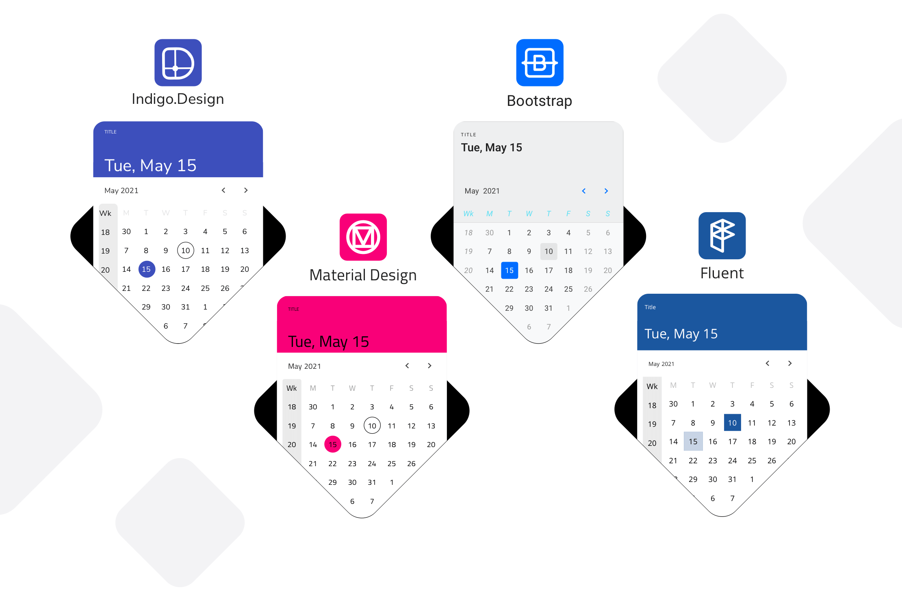
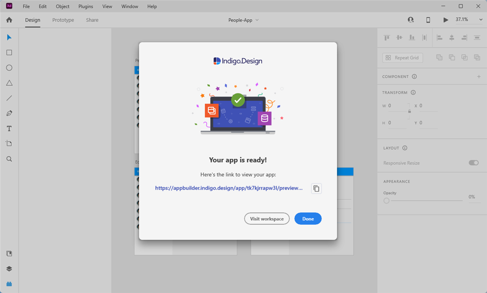

# Getting Started

Indigo.Design is a unified platform for visual design, UX prototyping, code generation and app development. It’s aimed at design and development teams looking to deliver pixel perfect apps as quickly as possible, without losing focus on UX.

Design to development workflow

Indigo.Design platform consists of three main modules - **UI Kits**, **Prototypes/Usability Studies** and **App Builder**. **The UI Kits (Sketch, Figma, XD)** map to real UI controls and components, with tooling that delivers productivity. Each **UI Kit** implements and follows strictly - Colors, Typography, Sizes and etc. While **Prototypes and Usability Studies** help you measure and improve the user experience of a product or feature. **The App Builder** enables users build their own applications in a web environment and generate **Angular, React, Blazor or Web Components** code from it.

## How does this work?

Indigo.Design offers key capabilities to support the design-to-development workflow:

1. Create designs in Figma, Sketch or Adobe XD with the `Indigo.Design System`
2. Share as prototypes to test and collaborate with users via `cloud.indigo.design`
3. Design your app in `Ignite UI App Builder` using a Figma, Sketch or Adobe XD file and import it via the Plugin or directly use the [Ignite UI App Builder](https://appbuilder.indigo.design/).
4. Generate Angular, Blazor, React or Web components code from your application in the [Ignite UI App Builder](https://appbuilder.indigo.design/), using the its `Code Generation` service. 

## Indigo.Design System

The design system is a set of libraries for Figma, Sketch and Adobe XD, containing various assets, styles, components, and patterns. Тhe UI components allow you to create intricate user interfaces providing you with the flexibility to use various states and templates. To customize their appearance you may leverage the pre-made palettes, typographies, shadows, icons, and illustrations. And finally, with the provided collection of patterns, such as product details layouts, various forms, and pricing tables among others, you are able to streamline app design assuring the application of best practices in UI and interaction design.

Figma UI Kit for Material

### Figma UI Kit
The brand-new Figma Indigo.Design UI Kit for Material maps to our Ignite UI for Angular, Blazor and Web Components UI toolset to completely redefine design-development processes. You now get a robust set of components, patterns, styling, and customization options, enabling you to import prototypes or any type of screen designed in Figma and transform it clean code. The best part is that all static designs become interactive, responsive apps with real UI components, branding, and styling – in a single click.

Figma UI Kit

You can download the Figma Plugin, UI kit and sample apps from the [Download Assets page.](https://cloud.indigo.design/resources/figma)

Or through the direct links below:
- [Figma UI Kit](https://www.figma.com/@infragistics)
- [Plugin for Figma](https://www.figma.com/community/plugin/1170035114372031474) 
- [Sample Apps](https://download.infragistics.com/products/Infragistics/Indigo.Design/Samples/Infragistics_IndigoDesign_Sample_Apps_Figma.zip)

> [!Note]
> There is a difference when using the kit as a free Figma user or Pro user - [topic](https://www.infragistics.com/products/appbuilder/help/ui-kits/figma#using-the-kit-as-a-free-figma-user-vs-pro-user)

### Sketch UI Kit
Indigo.Design for Sketch offers not one but four library files to its users: one for each of the design languages we support - Material, Bootstrap, Fluent UI, and our very own Indigo. All four libraries support seamless switching between light and dark mode via the [Indigo.Design plugin](./plugins/sketch-plugin.md) and work with any of the predefined or custom color palettes it provides. With this improvement, Sketch users are able to enjoy 100% native look and feel of their components and patterns for the design language of their choice.

Sketch UI Kit Four themes

You can download the Sketch Plugin, UI kit and sample apps from the [Download Assets page.](https://cloud.indigo.design/resources/sketch).

Or through the direct links below:
- [Sketch UI Kit](https://dl.infragistics.com/products/Infragistics/Indigo.Design/ABECAC7231EE434C8CD3DC619BE6F75B/Infragistics_IndigoDesign_UI_Kit.zip)
- [Plugin for Sketch](https://dl.infragistics.com/products/Infragistics/Indigo.Design/9EB45F5BB4B3442F8B4CECB3EB403063/Infragistics_IndigoDesign_Sketch_Plugin.zip)
- [Sample apps](https://dl.infragistics.com/products/Infragistics/Indigo.Design/Samples/Infragistics_IndigoDesign_Sample_Apps.zip)

### Adobe XD UI Kit

Crafted from the ground-up to equip designers with a modern and easy-to-use arsenal of tools which allow them to design wireframes and apps, Adobe XD is one of the popular vector graphic design platforms in the market today. Along with wireframe features, designers can create hi-fidelity prototypes, collaborate across teams through the design process, configure animations and collect feedback.

> [!NOTE]
> Download [Adobe XD UI Kit](https://assets.adobe.com/public/c1a672c5-49e6-4df1-4d32-1c37fa234f1e), [Plugin for Adobe XD](https://exchange.adobe.com/creativecloud/plugindetails.html/app/cc/92c7dec5) and [Sample apps](https://download.infragistics.com/products/Infragistics/Indigo.Design/Samples/Infragistics_IndigoDesign_Sample_Apps_XD.zip)

Adobe XD Plugin

## Prototyping & Usability Testing

To get feedback on your designs, use cloud.indigo.design to import the Sketch document and share it as an interactive prototype. This will allow your stakeholders to view your prototype on any device and give feedback via comments.

Learn more with this guidance topic:

[Create prototypes in the cloud](prototyping/creating-a-prototype.md)

If you want to watch how users use your prototype to complete specific tasks, and also collect metrics like time on task and completion rate, set up a usability test using the published prototype.

Learn more with this guidance topic:
[Set up a user test](prototyping/set-up-a-user-test.md)

## Design apps with App Builder

The App Builder module lets you design a single page application using a design file (Figma, Sketch or Adobe XD) as a starting point or create it from scratch. The App Builder includes a set of major features, enabling users to use real UI components, global theming, external data sources.

Design canvas

Learn more:
- [Build an application in the App Builder - Getting started](https://www.infragistics.com/products/appbuilder/help/getting-started).
- [App Builder interface overview](https://www.infragistics.com/products/appbuilder/help/interface-overview).
- [Flex layouts](https://www.infragistics.com/products/appbuilder/help/flex-layouts/flex-layouts).
- [Components](https://www.infragistics.com/products/appbuilder/help/indigo-design-app-builder-components).
- [Interactions](https://www.infragistics.com/products/appbuilder/help/interactions).
- [SPA and navigation](https://www.infragistics.com/products/appbuilder/help/single-page-apps-and-navigation).
- [Share and preview apps](https://www.infragistics.com/products/appbuilder/help/share-preview-edit-app).

Create app from sample application:

Sample apps

## Generate Code

Once ready with the design of your application in Ignite UI App Builder, you can easily generate Angular, Blazor or Web Components code from it. The generated code can be directly uploaded to a repository in GitHub or downloaded locally as a file package. The components used in the generated application are powered by [Ignite UI for Angular UI framework](https://www.infragistics.com/products/ignite-ui-angular)

Learn more:

- [Generating code from an application in Ignite UI App Builder](https://www.infragistics.com/products/appbuilder/help/generate-app/generate-app-overview)
- [Blazor code generation](https://www.infragistics.com/products/appbuilder/help/blazor-support)
- [Web Components code generation](https://www.infragistics.com/products/appbuilder/help/web-components-support)

If you are brand new to Indigo.Design learn more about how to create your first artboard with it:
* [Create your first Sketch artboard](creating-artboard-sketch.md)
* [Create your first Adobe XD artboard](creating-artboard-adobexd.md)
