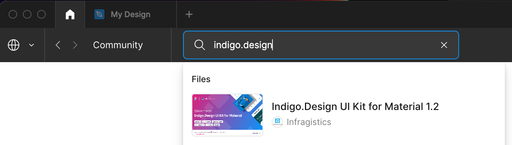
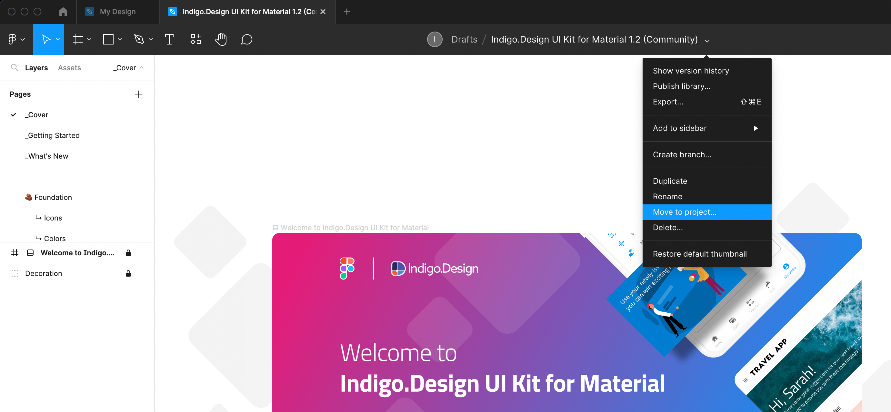
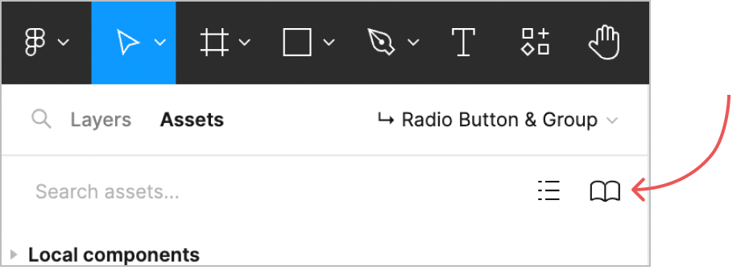
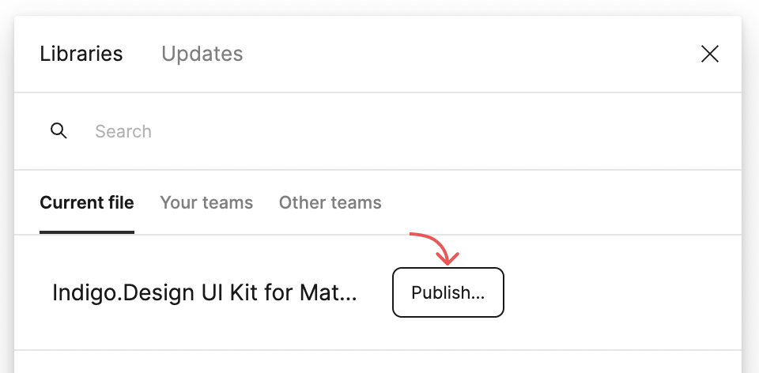
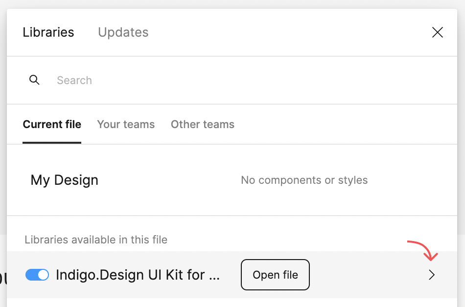
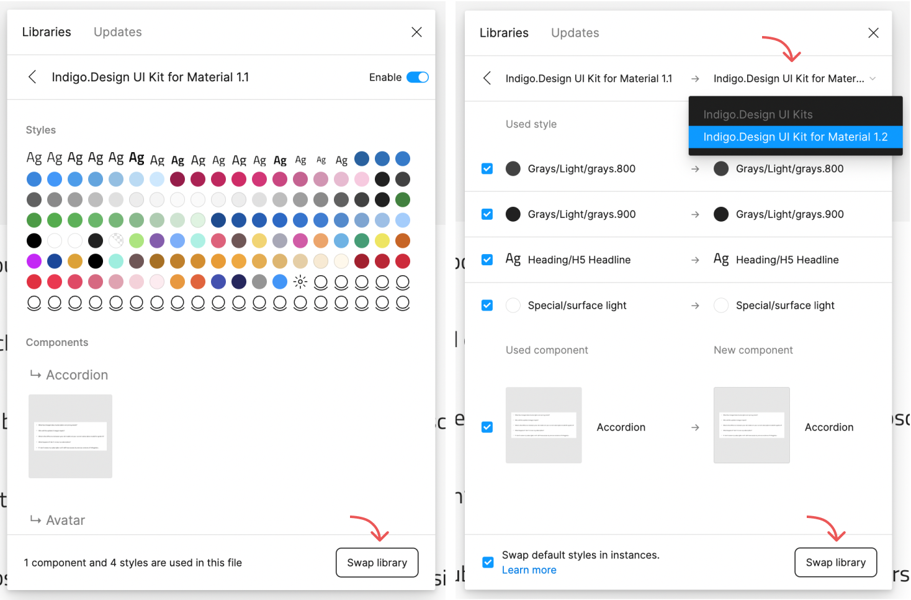
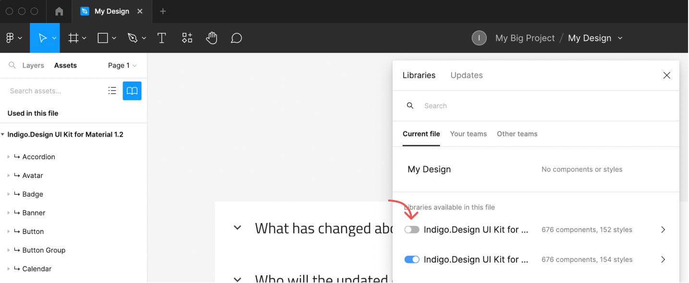

# How to swap your currently used Figma library with a newer version of it

## Replace an existing library
To replace an existing library with a newer version, start by opening the Figma Community and then duplicate the desired version of the UI Kit file you want to use from now on. For example, if your team currently uses Indigo.Design UI Kit for Material version 1.1, and you want to upgrade to 1.2 version of the kit, follow these steps:

1. Access the Figma Community space and search for "Indigo.Design UI Kit for Material" by Infragistics.
2. Notice that version 1.2 is the most recent release, and click on it.

Indigo.Design UI Kit for Material 1.2

3. Click on the Open in Figma blue button to duplicate the file.
4. Locate the Toolbar above the canvas and find the drop-down menu next to the UI kit name.
5. Select the "Move to project..." option from the menu. (Keep in mind that if you plan to share the UI Kit library with your team, you must move it from "Drafts" to the specific project space where it will be used.)

## Access the Assets tab

Move to project

Having successfully moved the newer 1.2 version of the UI Kit to the desired project space, you should now access the "Assets" tab. Located on the left side of the screen, just below the Toolbar, the "Assets" tab can be clicked to reveal the Team library button icon on the right.

Assets loading

## Publish the library
By clicking on this icon button, a modal window will appear. Under Current file tab you should find the Indigo.Design UI Kit for Material version 1.2 library, which you recently duplicated. Clicking the "Publish" button allows you to share the library with your team members within the specific team project space.

Publish the library

Once the library has been published, go to your design file that has been done with the previous 1.1 version of the UI Kit. Open the Assets and click on the Team library button icon again. To swap the old library version with the new one, click on the arrow icon located next to the library name.

Open file

## Swap library
On the bottom right of the next screen you should be able to see the following button “Swap library”. Click it and then you will be able to select the Indigo.Design UI Kit for Material 1.2 from the drop-down.

Swap libraries

Once you do, click the "Swap library" button again, and all components and styles within your design file will automatically update to the new version of the UI Kit. Now you can turn off your old version of the UI kit and keep on designing with the new one instead.

Disable the old library version

> [!Note]
> Before updating, ensure that you haven't made any changes to the component or style names in the old library version. If any changes are made, Figma may not recognize the component or style, and the library swap may not be successful.

*General information about swapping Figma libraries can be found on the following link: 
help.figma.com/hc/en-us/articles*