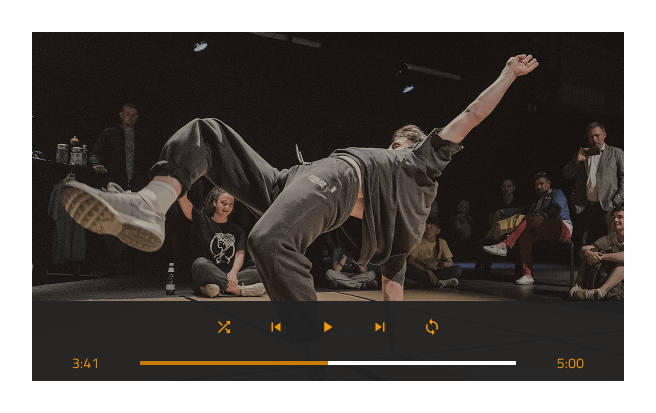
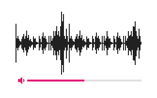
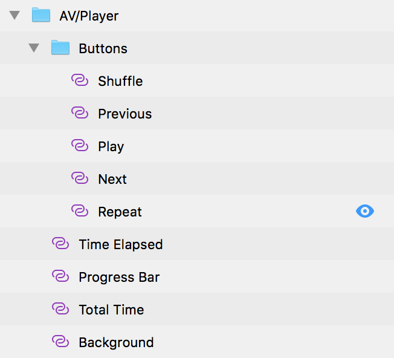
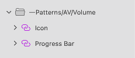

# Audio / Video

Use the AV Pattern to complement a represenatation of an audio or video track with playback controls.

The AV Pattern comes with the styling flexibility provided by the Icon Buttons and Linear Progress Bar that shape its layout.

> [!WARNING]
> After inserting an AV Pattern, you should trigger `Detach from Symbol` to break it down to the Components that are used to create the layout in order to be able to generate it as Angular code. The individual Components, however, must stay intact and not be detached!

## Additional Resources

Related topics:

- [Button](../components/button.md)
- [Progress](../components/progress.md)
  

Our community is active and always welcoming to new ideas.

