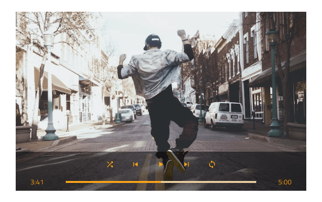

# Audio / Video

Use the AV Pattern to complement an audio or video track representation with playback controls.

The AV Pattern comes with the styling flexibility provided by the Icon Buttons, Linear Progress Bar and text that shape its layout.

## Additional Resources

Related topics:

- [Button](../components/button.md)
- [Progress](../components/progress.md)

Our community is active and always welcoming to new ideas.