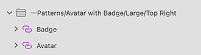

## Avatar + Badge

Use the Avatar + Badge Pattern to complement the graphical representation that the Avatar provides with a short subtle message or indication for an alert or notification.

The Avatar + Badge Pattern comes with the styling flexibility provided by the Avatar and Badge that constitute its layout.

### Size

The Avatar + Badge Pattern supports the same sizes that the Avatar does:

- Large - Suitable for profile pages
- Medium - Appropriate for custom menus and visualizations
- Small - Easily embedded in a contact list and similar repetitive scenarios

### Position

The Badge can be positioned in any of the four corners of the Avatar as shown below through the help of an override.

> [!WARNING]
> After inserting an Avatar + Badge layout and choosing the position `Override` that takes care of the Pattern layout, you should trigger `Detach from Symbol`. This will break it up to the Components that are used to create the Pattern in order to be able to generate it as Angular code. The Badge and the Avatar, however, must stay intact and not be detached!

## Additional Resources

Related topics:

- [Avatar](avatar.md)
- [Badge](badge.md)
  

Our community is active and always welcoming to new ideas.

- [Indigo Design **GitHub**](https://github.com/IgniteUI/design-system-docfx)
