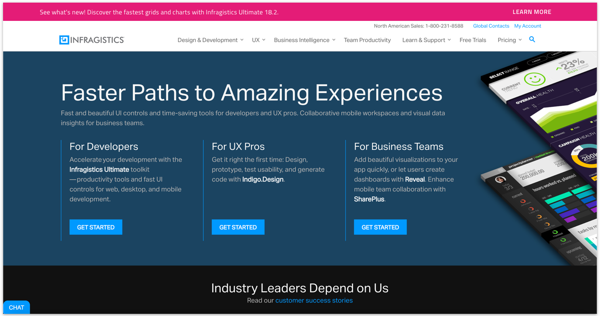
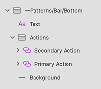

# Bar

Use the Bar Pattern to display new and important information for the user such as product version update, new release, as well as for notifying users for available cookies on a website. Bar can be placed above the header or at the bottom of the page depending on users' needs, bar importance and general design.

The Bar Pattern comes with two versions for placing on the top and bottom of the page.

> [!WARNING]
> After inserting any of the Bar Patterns available, you should trigger `Detach from Symbol` to break it down to the Components that are used to create the layout in order to be able to generate it as Angular code. The buttons, however, must stay intact and not be detached!

## Additional Resources

Related topics:

- [Button](../components/button.md)
  

Our community is active and always welcoming to new ideas.

