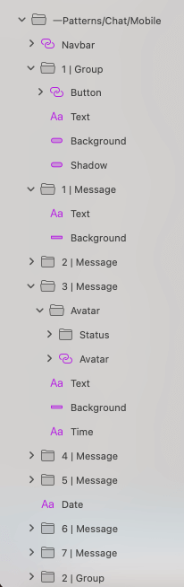

# Chat

Use the Chat Pattern to display real-time bidirectional messaging between two or more people within an application in different scenarios such as social networks, e-commerce apps, business apps, etc. Chat Patterns suitable for mobile, desktop, and web applications are provided.

> [!WARNING]
> After inserting any of the Chat Patterns you should trigger `Detach from Symbol` in order to be able to generate the Pattern as Angular code. The various Components that lay it out must stay intact and not be detached!

## Additional Resources

Related topics:

- [Navbar](../components/navbar.md)
- [Button](../components/button.md)
- [Avatar](../components/avatar.md)
- [Icon](../components/icon.md)
- [List](../components/list.md)
- [Input](../components/input.md)
- [Badge](../components/badge.md)
  

Our community is active and always welcoming to new ideas.
