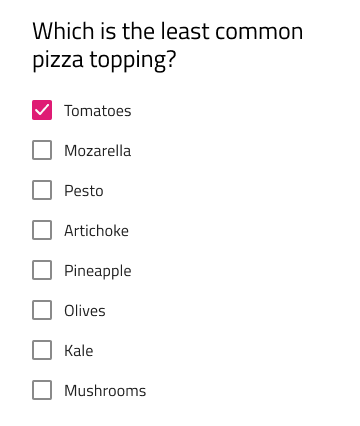
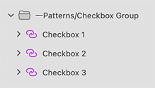

## Checkbox Group

Use the Checkbox Group Pattern to organize and layout a collection of Checkbox elements as a group, e.g. to contain the answers for a multiple choice question.

> [!Note]
> Trigger `Detach from Symbol` on an instance of the Checkbox Group Pattern only if you need to create more items than provided.

The Checkbox Group Pattern comes with the styling flexibility provided by the Checkbox elements that constitute it.

> [!WARNING]
> After inserting a Checkbox Group, you should trigger `Detach from Symbol` to break it down to the individual Checkboxes that are used to create the layout in order to be able to generate it as Angular code. The Checkboxes, however, must stay intact and not be detached!

## Additional Resources

Related topics:

- [Checkbox](../components/checkbox.md)
  

Our community is active and always welcoming to new ideas.

