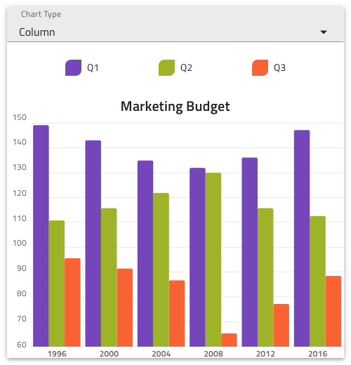
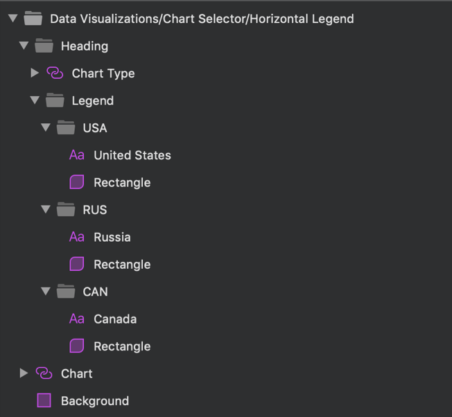

# Data Visualizations

Use the Data Visualizations Pattern to present information and data in various visual ways, such as Area, Column,Line, Spline chart. This pattern let users select layout from different types of data representation, for example through drop down component.

The Data Visualization Pattern comes with styling flexibility provided by the Chart component, Input and Text elements that constitute it.

> [!WARNING]
> After inserting a Data Visualization Pattern, you should trigger `Detach from Symbol` to break it down to the separate components that are used to create the layout in order to be able to generate it as Angular code. The Category Chart itself, however, must stay intact and not be detached!

## Additional Resources

Related topics:

- [Chart-Category](../components/chart-category.md)
  

Our community is active and always welcoming to new ideas.

