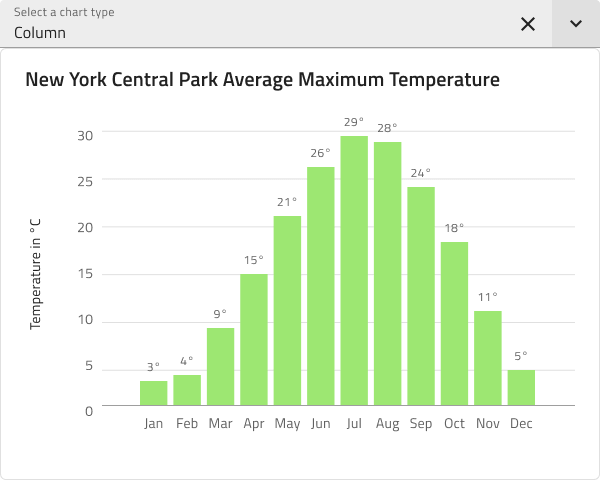

# Data Visualizations

Use the Data Visualizations Pattern to present information and data in various visual ways, such as Area, Column, Line, Spline chart. This pattern let users select layout from different types of data representation, for example through drop down component.

The Data Visualization Pattern comes with styling flexibility provided by the Chart and the Select component.

## Additional Resources

Related topics:

- [Select](../components/select.md)
- [Column Chart](../components/column-chart.md)
- [Line Chart](../components/line-chart.md)
- [Spline Chart](../components/spline-chart.md)
  

Our community is active and always welcoming to new ideas.

