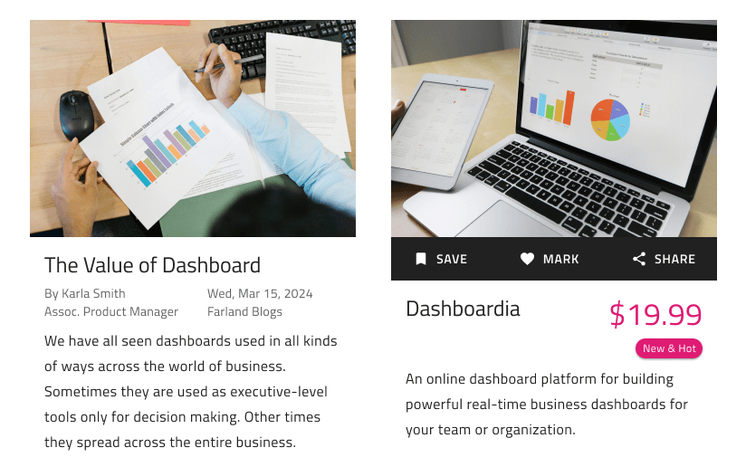

## Details

Use the Details Pattern to display detailed information as a full-screen page usually depicting things such as articles, products, recipes etc.

The Details Pattern comes with the styling flexibility provided by the Badges, Buttons, Tabs, and Text elements that constitute it.

### Content Types

The Details Pattern supports the following interchangeable pieces of content that, when combined, shape up its layout: Action Bar, Badge, Description, Metadata, Tabs, and Title and Price.

> [!WARNING]
> After inserting a Details Pattern, you should trigger `Detach from Symbol` to break it down to the individual Components that are used to create the Pattern layout in order to be able to generate Angular code. The Components that lay out the detached sections, however, must stay intact and not be detached!

## Additional Resources

Related topics:

- [Badge](../components/badge.md)
- [Button](../components/button.md)
- [Tabs](../components/tabs.md)
- [Text](../components/text.md)
  

Our community is active and always welcoming to new ideas.

- [Indigo Design **GitHub**](https://github.com/IgniteUI/design-system-docfx)
