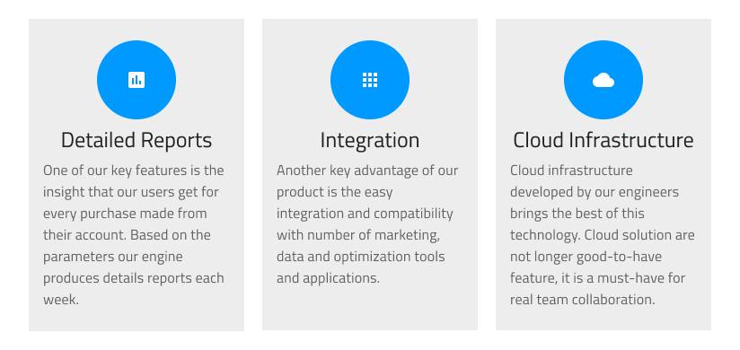

# Details

Use the Details Pattern to display detailed information as a full-screen page usually depicting things such as articles, products, recipes etc.

The Details Pattern comes with the styling flexibility provided by the Badges, Buttons, Tabs, and Text elements that constitute it.

## Icon + Title 

Use the Icon + Title Pattern to present a single element from a set of elements through avatar with featured icon or image, title and rich-text description. It can be used for various scenarios, such as product feature description and single step of wizard sequence.

The Details: Icon + Title Pattern comes with the styling flexibility provided by the Avatar with Icon or Image, Title and Text components that constitute its layout.

## Additional Resources

Related topics:

- [Badge](../components/badge.md)
- [Button](../components/button.md)
- [Tabs](../components/tabs.md)
  

Our community is active and always welcoming to new ideas.

