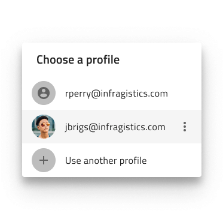
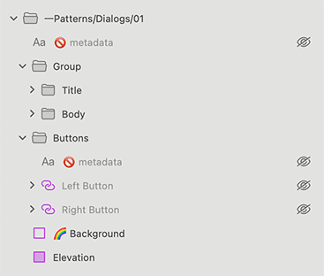

# Dialogs

Use the Dialogs Pattern to alert or give the user relevant information for an error or a system state that requires urgent user input. Dialogs are usually triggered by a user's action and should be displayed over the main content. It's best when dialogs are used sparingly as they are in a way distracting to the user.

The Dialogs Pattern comes with the styling flexibility provided by the Avatar, Button, Checkbox, Input and List that constitute its layout.

> [!WARNING]
> After inserting a Dialogs Pattern you should trigger `Detach from Symbol` in order to be able to generate it as Angular code. The individual Components, however, must stay intact and not be detached!

## Additional Resources

Related topics:

- [Avatar](../components/avatar.md)
- [Button](../components/button.md)
- [Checkbox](../components/checkbox.md)
- [Input](../components/input.md)
- [List](../components/list.md)
  

Our community is active and always welcoming to new ideas.

