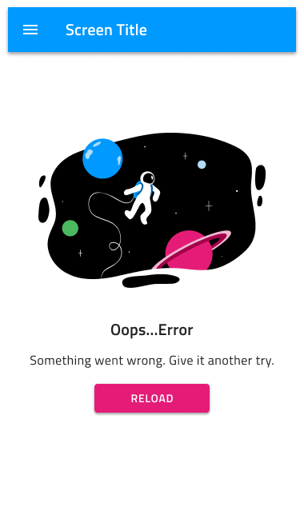
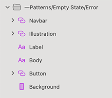

# Empty States

Use the Empty States Patterns to provide the users with helpful information when there is no content to show due to a system error or when there are no results to be displayed when a filter is applied to encourage them to interact with your product. Usually an empty screen without any type of guidance or exact explanation can confuse users and prevent them from using your product or service.

The Empty States Patterns come with the styling flexibility provided by the Navbar and Button that constitute their layout.

> [!Note]
> Illustrations nested inside the Pattern Symbols cannot be code generated and Illustration itself has to be inserted manually.

> [!WARNING]
> After inserting an Empty State Pattern, you should trigger `Detach from Symbol` in order to be able to generate it as Angular code. Illustrations nested inside the Pattern cannot be code generated and the Illustration itself has to be inserted manually after that step. Individual Components must stay intact and not be detached!

## Additional Resources

Related topics:

- [Illustrations](../style/illustrations.md)
- [Button](../components/button.md)
- [Navbar](../components/navbar.md)
  

Our community is active and always welcoming to new ideas.
