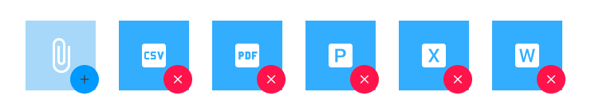

## File Upload

Use the File Upload Pattern to provide the uploading and insertion mechanisms for files, images, or attachments.

The File Upload Pattern comes with the styling flexibility provided by the Avatar and Icon Button that constitute its layout.

### Type

The File Upload Pattern provides two types of previews for the uploaded file: an Avatar and a Document, shown in a standard image.

### Content

The File Upload Pattern supports the most common types of content that are usually uploaded or inserted as Documents: CSV, PDF, Presentation, Spreadsheet, and Text. Additionally, an Upload and Attach types are available to provide further flexibility for various appliction scenarios.

## Additional Resources

Related topics:

- [Avatar](avatar.md)
- [Button](button.md)
  

Our community is active and always welcoming to new ideas.

- [Indigo Design **GitHub**](https://github.com/IgniteUI/design-system-docfx)
