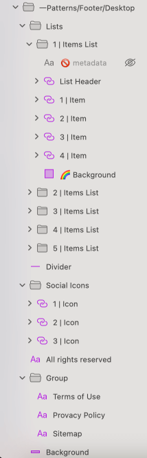

# Footer

Use the Footer Pattern to display a website's essential content such as site pages, a privacy policy, terms of service, social media links, subscription form, etc. in a consistent view. The Footer content can be structured in a vertical or horizontal layout and lays at the bottom of the page. A Footer Patterns for desktop and mobile devices are provided.

> [!WARNING]
> After inserting any of the Footer Patterns you should trigger `Detach from Symbol` in order to be able to generate the Pattern as Angular code. The various Components that lay it out must stay intact and not be detached!

## Additional Resources

Related topics:

- [List](../components/list.md)
- [Icon](../components/icon.md)
  

Our community is active and always welcoming to new ideas.