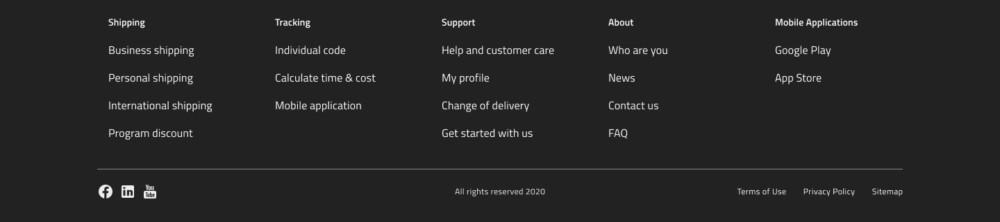

# Footers

Use the Footer Pattern to display a website's complementary content such as site pages, a privacy policy, terms of service, social media links, subscription form, etc. in an unobtrusive and consistent way. Its content can be laid out vertically or horizontally and sits at the bottom of the page. Footer Patterns suitable for desktop and mobile device screen sizes are provided.

## Additional Resources

Related topics:

- [Button](../components/button.md)
- [Divider](../components/divider.md)
- [List](../components/list.md)
- [Icon](../components/icon.md)
  

Our community is active and always welcoming to new ideas.
