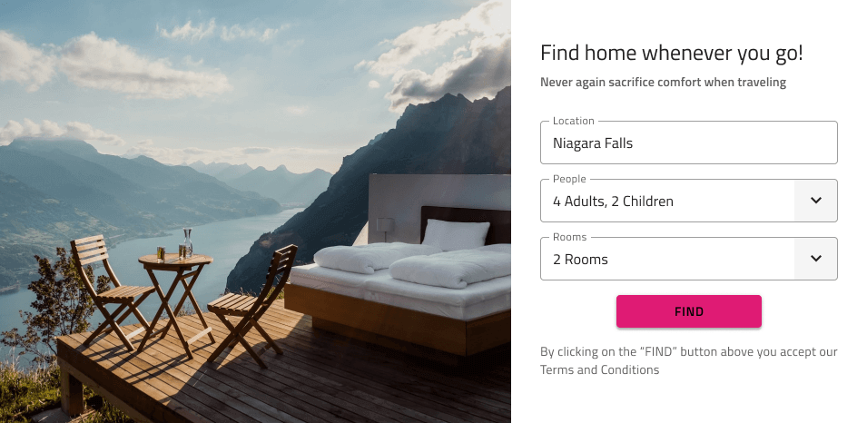
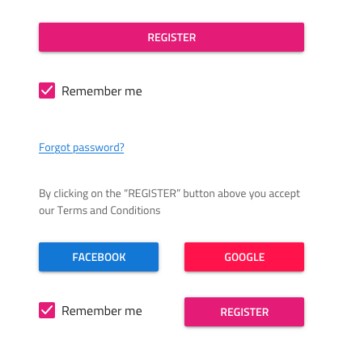
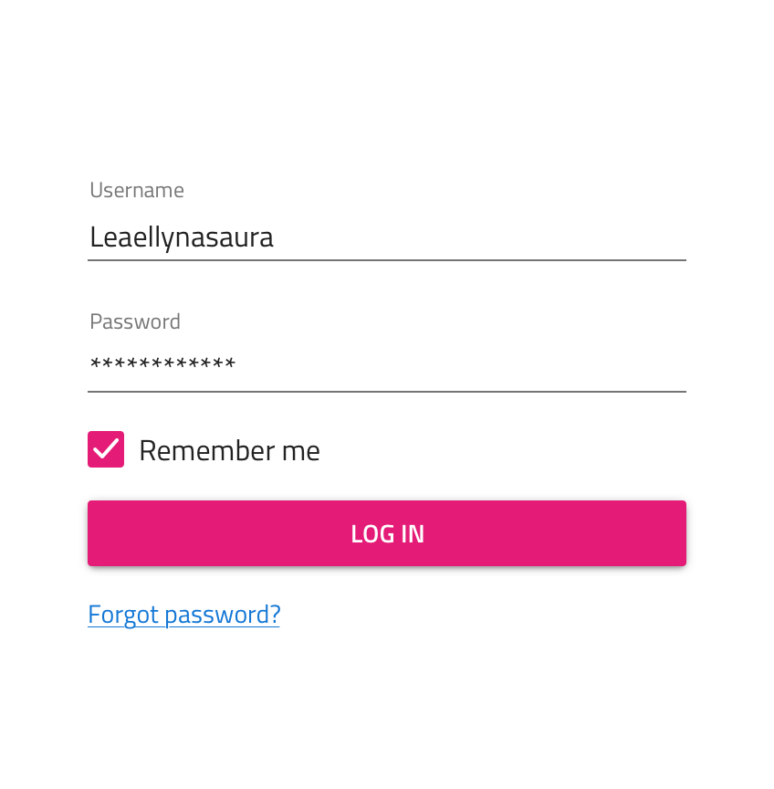
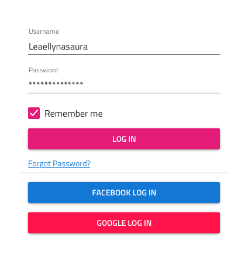
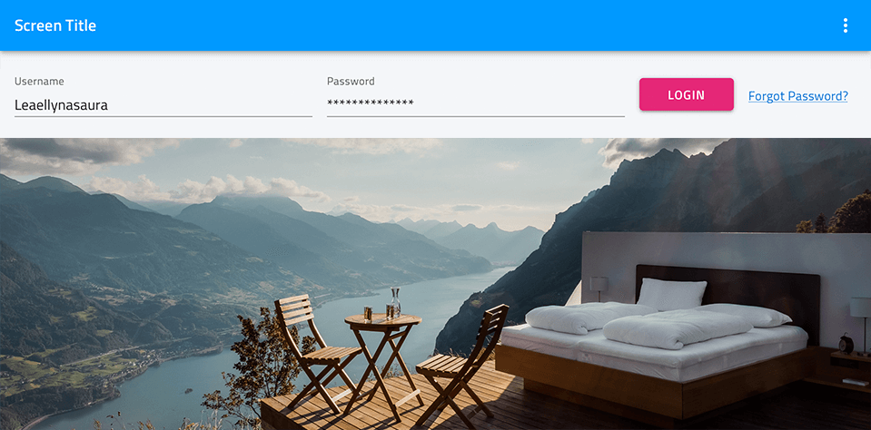
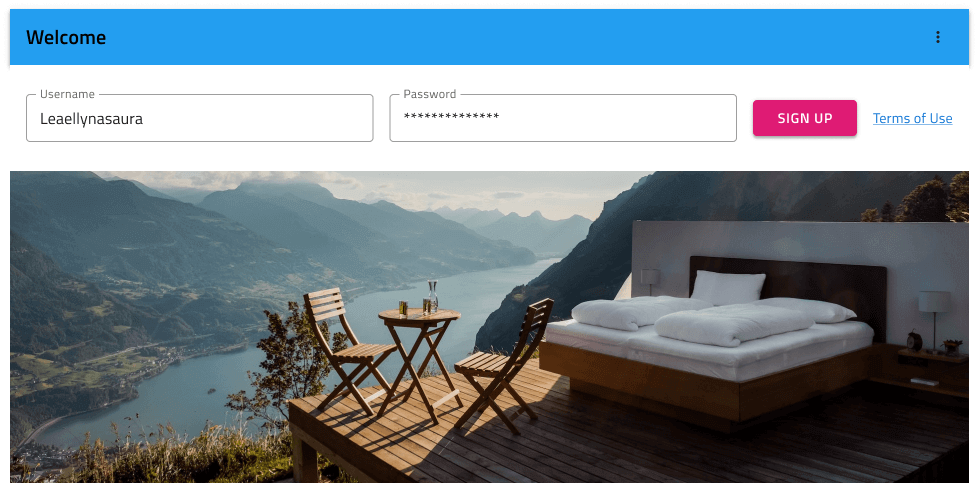
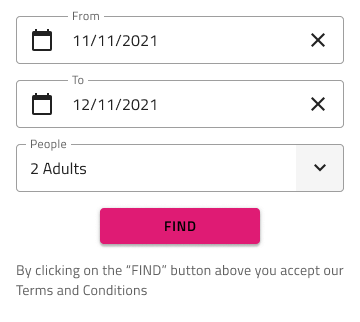
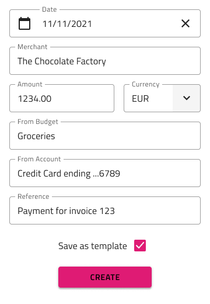
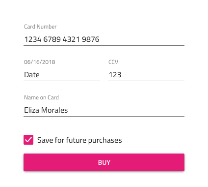
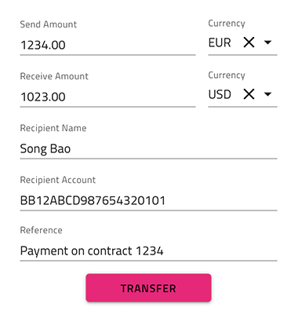

## Form

The Form Pattern comes with the styling flexibility provided by the Input, Checkbox, Button, Hyperlink, and Text that constitute its layout.

The Form Pattern comes with the styling flexibility provided by the Input, Checkbox, Button, Hyperlink and Text that constitute its layout.

### Layout and Type

The Form Pattern is split in two main areas: an Inputs area with the main content for the various pieces of information that need to be filled in, and an Actions area where actions are laid out in rows, e.g. the "Terms of Use" or "Remember Me" Checkbox, the "Forgot Password?" link, and the Buttons for submitting the form. The Actions area is organized into three rows of interchangeable items that can be: Button, Checkbox, Link, Text Area, or Two Actions that appear as buttons by default but can be any combination of the items mentioned before.

The Form Pattern provides various forms for some of the most common application scenarios such as: Login and Registration, Booking, Address, Payment, and New, allowing the user to add content.

##### Login and Registration Forms

The Login and Registration Forms are organized in two separate groups but they both have a "simpler" layout with meaningful Content and an Action Areas, as well as, a more elaborate layout with an additional Action Area for social login or registration.

The Login Form also comes with a Horizontal layout which can be customized for a Registration Form once the Button and Hyperlink content is updated accordingly. This layout is more appropriate for wide screens, where the form appears inline with other content.

##### Booking Forms

There are four presets for Booking Forms, selectable through the Inputs override: Dates + People, which is rather generic; Dates + People + Rooms, which is appropriate for booking accommodation; Airports + Dates + People, which is best for booking airline tickets or other transportation; and Location + People + Rooms, which is again most suitable for booking an accommodation.

##### New Forms

There are two types of New Forms, selectable through the Inputs override: **Expense** for filling the information necessary to create a new expense, and Budget for filling the information necessary to allocate a new budget.

##### Payment Forms

There are two main types of Payment forms: one for Card payments and one for Cash Transfers, like when you wire money through your online banking. The Cash Transfer Form provides four different layouts, selectable through the Inputs override: **Currency Exchange**, which has the necessary fields for currency conversion; Donation, which is suitable for charities; Between Accounts, which is usually the case for people holding multiple accounts in the same bank; and Between Banks, which is the common scenario for transferring money to another account under your or someone else's name.

## Additional Resources

Related topics:

- [Button](button.md)
- [Checkbox](checkbox.md)
- [Hyperlink](hyperlink.md)
- [Input](input.md)
- [Text](text.md)
  

Our community is active and always welcoming to new ideas.

- [Indigo Design **GitHub**](https://github.com/IgniteUI/design-system-docfx)
