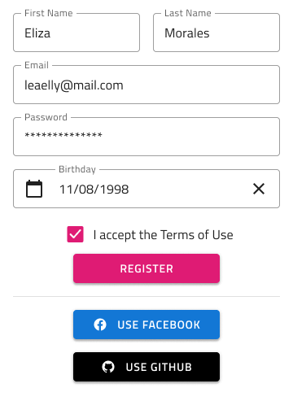

## Form

Use the Form Pattern to create meaningful application scenarios, where the collection of user input is necessary. The various data entry and display Components are used to constitute some of the most common and meaningful Forms.

The Form Pattern provides various forms for some of the most common application scenarios such as: Login and Registration, Booking, Address, Payment, and New, allowing the user to add content. All these come with the styling flexibility provided by the Input, Checkbox, Button, Hyperlink, and Text elements that constitute the layout.

##### Log In and Registration Forms

The Log In Forms come in a "simpler" layout with meaningful content and actions, as well as, a more elaborate layout with additional actions for social login.

The Registration Forms also come in a "simpler" layout with meaningful content and actions and a more elaborate layout with additional actions for registration via social media profiles.

The Log In Form provides a Horizontal layout which can be customized to present a Registration once the Button and Hyperlink content is updated accordingly. This layout is more appropriate for wide screens, where the form appears inline with other content.

##### Booking Forms

There are four presets for Booking Forms: Dates + People, which is rather generic; Dates + People + Rooms, which is appropriate for booking accommodation; Airports + Dates + People, which is best for booking airline tickets or other means of transportation; and Location + People + Rooms, which is again most suitable for booking an accommodation.

##### New Forms

There are two types of New Forms: Budget for filling the information necessary to allocate a new budget and Expense for filling the information necessary to create a new expense.

##### Payment Forms

There are two main types of Payment forms: one for Card payments and one for Transfers, like when you wire money through your online banking. The Transfer Form provides four different layouts: Currency Exchange, which has the necessary fields for currency conversion; Donation, which is suitable for charities; Between Accounts, which is usually the case for people holding multiple accounts in the same bank; and Between Banks, which is the common scenario for transferring money to another account under your or someone else's name.

> [!WARNING]
> After inserting any of the Form Patterns available, you should trigger `Detach from Symbol` in order to be able to generate it as Angular code. The individual Components, however, must stay intact and not be detached!

## Additional Resources

Related topics:

- [Button](../components/button.md)
- [Checkbox](../components/checkbox.md)
- [Hyperlink](../components/hyperlink.md)
- [Input](../components/input.md)
- [Text](../components/text.md)
  

Our community is active and always welcoming to new ideas.

