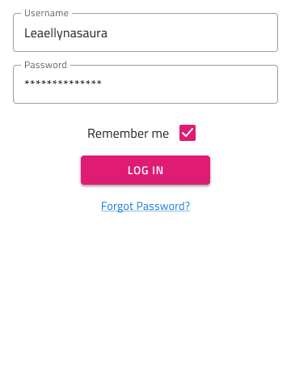
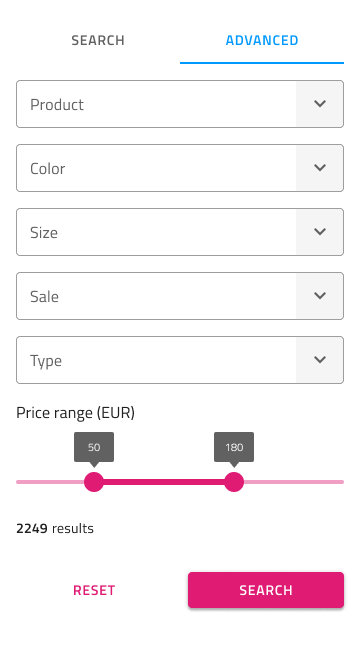
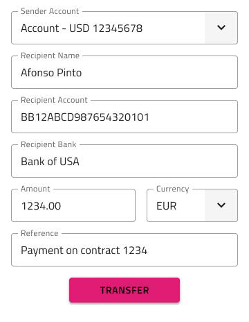

# Forms

Use the Form Pattern to create meaningful application scenarios where the collection of user input is necessary. The various data entry and display components are used to constitute some of the most common and meaningful forms.

The Form Pattern provides various forms for some of the most common application scenarios. For example - Login and Registration, Booking, Address, Payment, Contacts, Feedback, Search, Shipping, Subscription, Authentication, and New. These scenarios allow the user to add content. All these come with the styling flexibility provided by the Inputs, Checkboxes, Radio Groups, Buttons, and Hyperlinks that constitute the layout.

## Log In, Registration, and Authentication Forms

The Log In Forms come in a "simpler" layout with meaningful content and actions, as well as, a more elaborate layout with additional actions for social login.

The Registration Forms also come in a "simpler" layout with meaningful content and actions and a more elaborate layout with additional actions for registration via social media profiles.

The Log In Form provides a Horizontal layout that can be customized to present a Registration once the Button and Hyperlink content is updated accordingly. This layout is more appropriate for wide screens, where the form appears inline with other content.

## Booking Forms

There are four presets for Booking Forms: Dates + People, which is rather generic; Dates + People + Rooms, which is appropriate for booking accommodation; Airports + Dates + People, which is best for booking airline tickets or other means of transportation; and Location + People + Rooms, which is again most suitable for booking accommodation.

## New Forms

There are two types of New Forms: Budget for filling in the information necessary to allocate a new budget and Expense for filling in the information necessary to create a new expense.

## E-commerce Forms

There is an Address form, a Size Selection form, Simple and Advanced Search forms, and a few types of Payment forms: some for Card payments and some for Transfers, like when you wire money through your online banking. The Transfer Form provides four different layouts: Currency Exchange, which has the necessary fields for currency conversion; Donation, which is suitable for charities; Between Accounts, which is usually the case for people holding multiple accounts in the same bank; and Between Banks, which is the common scenario for transferring money to another account under your or someone else's name.

## Feedback and Contact Forms

There is a Feedback form for when you want to obtain certain information from your customers to improve your products or services and a Contact form for when you like to show that your business is easily reachable but want to keep an email address private.

## Subscription and Free Trial Forms

A Subscription form is suitable for generating leads by legally gathering email addresses of users interested in your company and products. There is also a Free Trial form for when you want to help your visitors in signing up for a free trial of your service or product.

## Email and Appointment Forms

There is an Email form that is suitable for sending an email to multiple addresses and an Appointment form that is best used for a doctor’s visit, applying for a visa, a job interview, or other formal meetings.

## Additional Resources

Related topics:

- [Illustrations](../style/illustrations.md)
- [Button](../components/button.md)
- [Checkbox](../components/checkbox.md)
- [Chips](../components/chips.md)
- [Combo](../components/combo.md)
- [Hyperlink](../components/hyperlink.md)
- [Input](../components/input.md)
- [List](../components/list.md)
- [Slider](../components/slider.md)
- [Switch](../components/switch.md)
- [Tabs](../components/tabs.md)

Our community is active and always welcoming to new ideas.
