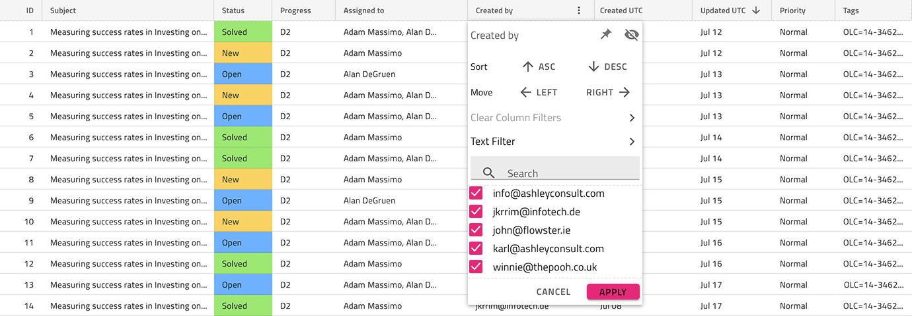

# Grid

Use any of the Grid Pattern symbols/components as an alternative starting point when designing a tabular data layout. They provide a full-blown contentwise and stylewise Grid Component, on which all the Grid functionality, provided in the Components Library can be applied.

The Grid Pattern with Column Moving, Summaries and Paging is shown below:

List of all the Grid functionality:
- Sorting
- Filtering
- Summaries
- Paging
- Editing
- Column Moving
- Column Resizing
- Column Hiding
- Display Density
- Excel Style Filtering
- Advanced Filtering
- GroupBy
- Pinning
- Row Selection
- Row Editing
- Active Cell
- Export
- Toolbar

Grid Pattern symbols come in six pre-made combinations of Grid features:
- Grid Pattern with Column Moving, Summaries and Paging
- Grid Pattern with Editing and Filter Row
- Grid Pattern with Excel Style Filter, Sorting and Display Density
- Grid Pattern with Group By, Column Resizing and Summaries
- Grid Pattern with Pinning, Row Selection and Active Cell
- Grid Pattern with Toolbar, Export, Row Editing and Column Hiding

> [!WARNING]
> In Sketch, after inserting any of the Grid Patterns, you can trigger `Detach from Symbol` only if you need to alter the number of cells provided, in order to show all the dimensions of your data and insert as many visible records as you want. The individual Components and Features, however, must stay intact and not be detached!
>
> In Adobe XD you can add more cells than provided by duplicating columns and rows without ever having to ungroup the pattern itself.

## Additional Resources

Related topics:

- [Grid](../components/grid.md)

Our community is active and always welcoming to new ideas.
