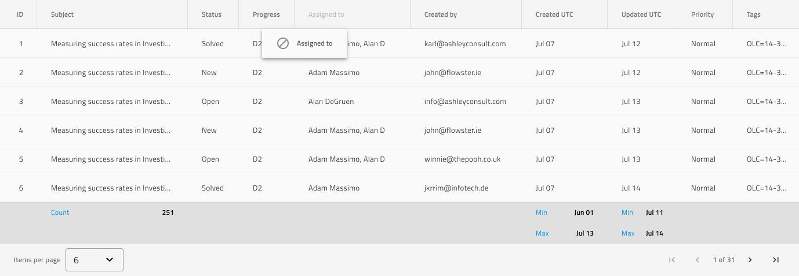

## Grid

Use the Grid Pattern symbol as an alternative starting point when designing a tabular data layout. It provides a full-blown contentwise and stylewise Grid Component that comes with all the Grid functionality, provided in the Components Library.

Below is illustrated the Grid Pattern with Excel Style Filter, Sorting and Display Density

List of all the Grid functionality:
- Sorting
- Filtering
- Summaries
- Paging
- Editing
- Column Moving
- Column Resizing
- Column Hiding
- Display Density
- Excel Style Filtering
- GroupBy
- Pinning
- Row Selection
- Row Editing
- Active Cell
- Export
- Toolbar

Grid Pattern symbol comes with six pre-made combinations of Grid features:
- Grid Pattern with Summaries, Column Moving and Paging
- Grid Pattern with Editing and Filter Row
- Grid Pattern with Excel Style Filter, Sorting and Display Density
- Grid Pattern with Group By, Column Resizing and Summaries
- Grid Pattern with Pinning, Row Selection and Active Cell
- Grid Pattern with Toolbar, Export, Row Editing and Column Hiding

> [!WARNING]
> After inserting the Grid Pattern, you should trigger `Detach from Symbol` to break it down to the Components and Grid symbols that are used to create the layout in order to be able to generate it as Angular code. The individual Components and Grid symbols, however, must stay intact and not be detached!

## Additional Resources

Related topics:

- [Grid](../components/grid.md)

Our community is active and always welcoming to new ideas.

