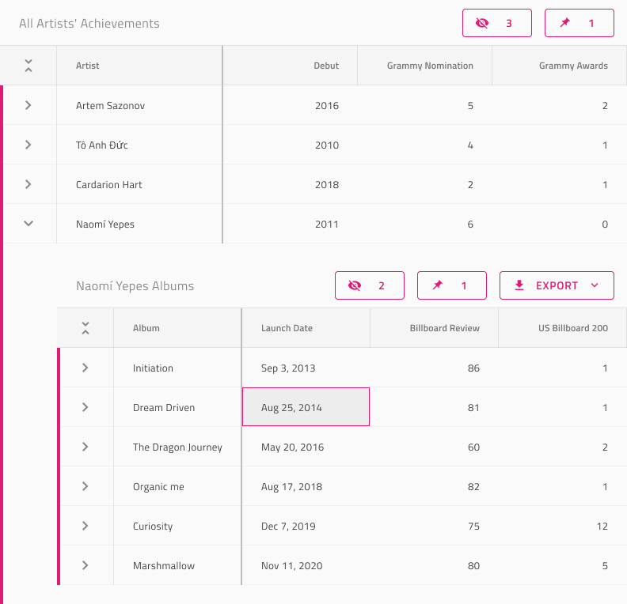

# Hierarchical Grid

Use the Hierarchical Grid Pattern as a starting point when designing complex Grid hierarchies with nested children and various features for each of them. It provides a parent-grid and a nested child-grid with an active cell and visual representation of the relationship between the parent and child grids.

List of all the Grid functionalities:
- [Grid Toolbar](../components/grid-toolbar.md)
- [Grid Export](../components/grid-export.md)
- [Grid Group By](../components/grid-grouping.md)
- [Grid Column Pinning](../components/grid-column-pinning.md)
- [Grid Column Hiding](../components/grid-column-hiding.md)
- [Grid Column Moving](../components/grid-column-moving.md)
- [Grid Column Resizing](../components/grid-column-resizing.md)
- [Grid Sorting](../components/grid-sorting.md)
- [Grid Row Filter](../components/grid-row-filter.md)
- [Grid Excel Style Filtering](../components/grid-excel-style-filter.md)
- [Grid Advanced Filtering](../components/grid-advanced-filter.md)
- [Grid Row Selection](../components/grid-row-selection.md)
- [Grid Editing](../components/grid-editing.md)
- [Grid Sizes](../components/grid-sizes.md)
- [Grid Paging](../components/grid-paging.md)
- [Grid Summaries](../components/grid-summaries.md)
- [Grid Skeleton](../components/grid-skeleton.md)

All Grid features are applicable to each child and parent Grid.

> [!WARNING]
> In Sketch, after inserting the Hierarchical Grid Pattern, you can trigger `Detach from Symbol` only if you need to alter the number of cells provided, in order to show all the dimensions of your data and insert as many visible records as you want. In case you need to show more of the hierarchy, you may also nest additional grids within the body of the parent one that they belong to. The individual Components and Features, however, must stay intact and not be detached!
>
> In Figma, this is achieved by right-clicking on the component and selecting `Detach instance`, after inserting the Hierarchical Grid Pattern from the Assets panel. After that you can apply the same modifications we've mentioned above.
>
> In Adobe XD you can add more cells than provided by duplicating columns and rows without ever having to ungroup the pattern itself.

## Additional Resources

Related topics:

- [Grid](../components/grid.md)
- [Hierarchical Grid](../components/hierarchical-grid.md)

Our community is active and always welcoming to new ideas.
