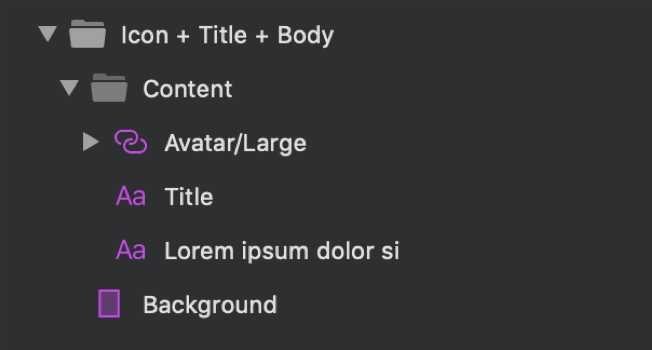

## Avatar + Badge

Use the Icon + Title Pattern to present a single element from a set of elements through avatar with featured icon or image, title and rich-text description. It can be used for various scenarios, such as product feature description and single step of wizard sequence.

The Icon + Title Pattern comes with the styling flexibility provided by the Avatar with Icon or Image, Title and Text components that constitute its layout.

> [!WARNING]
> After inserting an Icon + Title Pattern you should trigger `Detach from Symbol`. This will break it down to the Components that are used to create the Pattern in order to be able to generate it as Angular code. The Badge and the Avatar, however, must stay intact and not be detached!

## Additional Resources

Related topics:

- [Avatar](../components/avatar.md)
- [Text](../components/text.md)
  

Our community is active and always welcoming to new ideas.

