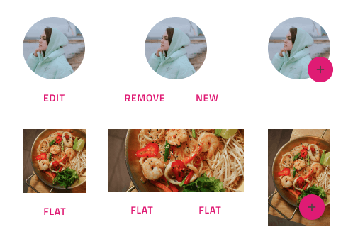
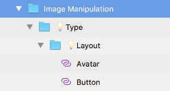

# Image Manipulation

Use the Image Manipulation Pattern to provide a way to edit, update, modify, or perform other quick actions on an image or Avatar containing a photo.

The Image Manipulation Pattern comes with the styling flexibility provided by the Avatar and various Buttons that constitute its layout.

## Layout

The Image Manipulation Pattern supports both standard images and Avatars that come in layouts with one or two Flat Buttons, FAB Button, or an Icon Button.

> [!WARNING]
> After inserting an Image Manipulation Pattern you should trigger `Detach from Symbol` in order to be able to generate Angular code. The individual Components, however, must stay intact and not be detached!

## Additional Resources

Related topics:

- [Avatar](../components/avatar.md)
- [Button](../components/button.md)
  

Our community is active and always welcoming to new ideas.

