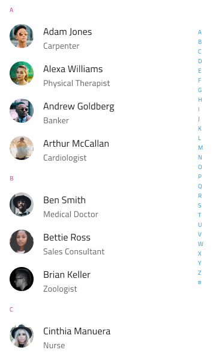
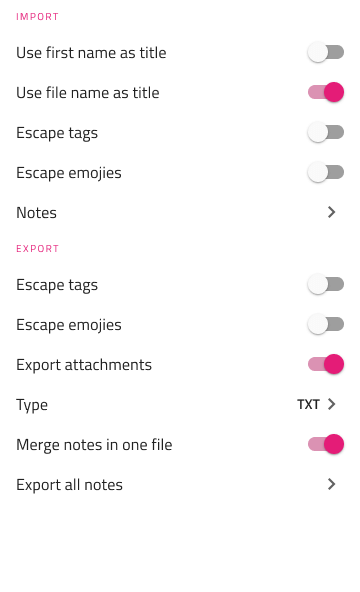
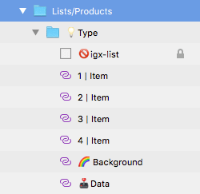

## Lists

Use the Lists Pattern Symbols as presets for organized collections of data depicting common scenarios such as filterable settings, people, song playlists, products, searchable lists, and settings.

The Lists Pattern comes with the styling flexibility provided by the various types of List Items available and the Searchbar Input, where applicable.

> [!WARNING]
> After inserting any of the Lists available as a Pattern, you should trigger `Detach from Symbol` to break it down to the Components that are used to create the layout in order to be able to generate it as Angular code.
> Some types of Lists like Products and Settings provide `Override` properties for selecting the desired type of List. Once this selection is made, make sure to trigger `Detach from Symbol` on `💡Type` as well.
> The individual List Items, as well as the background and data binding layers must stay intact and not be detached!

## Additional Resources

Related topics:

- [Input](../components/input.md)
- [List](../components/list.md)
  

Our community is active and always welcoming to new ideas.

- [Indigo Design **GitHub**](https://github.com/IgniteUI/design-system-docfx)
