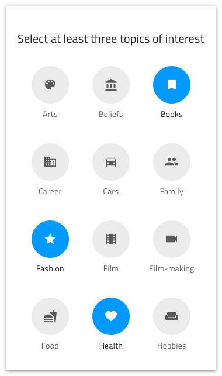

# Lists

Use the List Patterns as presets for organized collections of data in horizontal or vertical layout depicting common scenarios such as people, social media stories, multiline list elements, settings, recently used items, products, and categories of items among others.

## Empty State

Use the Empty State List Pattern to illustrate search with no available results.

## Group of Items

Use the Group of Items List Pattern to present grouped or organized items.

> [!WARNING]
> In Sketch, after inserting any of the Lists available as a Pattern, you can trigger `Detach from Symbol` only if you need to add more List items than provided. The individual List Items and Components such as Inputs, Avatars, and Navigation elements must stay intact and not be detached!
>
> In Adobe XD you can add a List item by duplicating one and it will simply line up with the others due to the applied stack.

## Additional Resources

Related topics:

- [Illustrations](../style/illustrations.md)
- [Input](../components/input.md)
- [List](../components/list.md)
- [Avatar](../components/avatar.md)
- [Navbar](../components/navbar.md)
  

Our community is active and always welcoming to new ideas.

