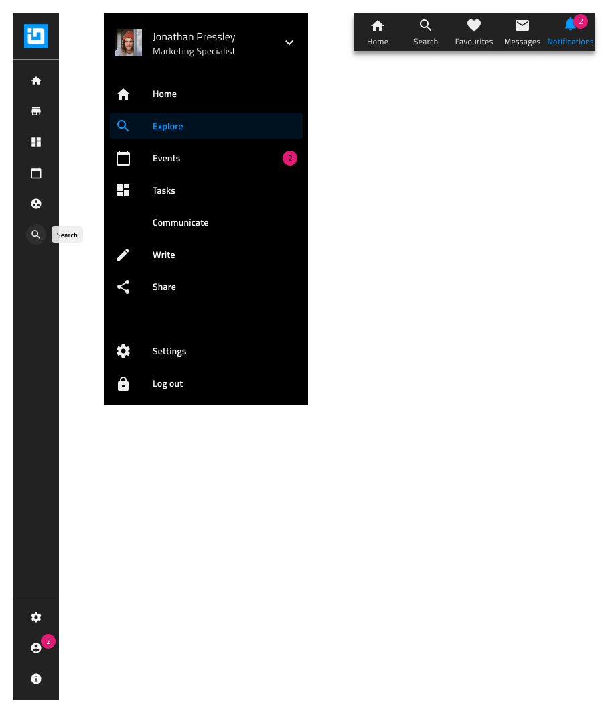

# Menu

Use the Menu Components as presets for building navigation bars for applications or webpages containing elements such as a logo, menu items, a search, various actions, and account settings among others.

## Types of Menus

There are two types of menus according to their orientation - Horizontal and Vertical.

Additionally, the menu patterns also offer variants based on the Navigation Drawer component and the Bottom Navigation Component.

## Additional Resources

Related topics:

- [Avatar](../components/avatar.md)
- [Badge](../components/badge.md)
- [Bottom Navigation](../components/bottom-nav.md)
- [Button](../components/button.md)
- [Dropdown](../components/dropdown.md)
- [Icon](../components/icon.md)
- [Input](../components/input.md)
- [Navigation Drawer](../components/nav-drawer.md)
- [Tooltip](../components/tooltip.md)
  

Our community is active and always welcoming to new ideas.
