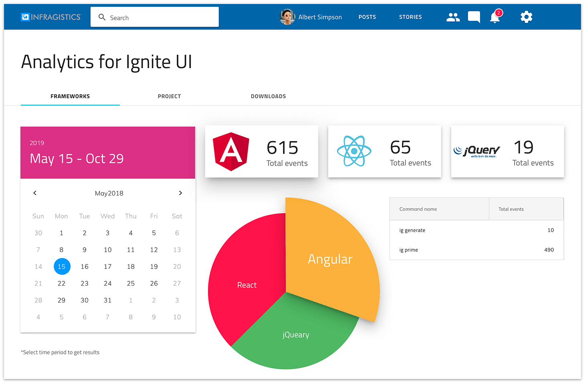
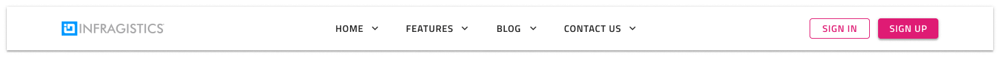
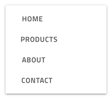

# Menu

Use the Menu Symbols (Components) as presets for building navigation bars for applications or webpages containing elements such as a logo, menu items, a search, various actions, and account settings among others.

## Orientation

The Menu presets are grouped according to their orientation into Horizontal and Vertical.

## Additional Resources

Related topics:

- [Avatar](../components/avatar.md)
- [Badge](../components/badge.md)
- [Bottom Navigation](../components/bottom-nav.md)
- [Button](../components/button.md)
- [Dropdown](../components/dropdown.md)
- [Icon](../components/icon.md)
- [Input](../components/input.md)
- [Navigation Drawer](../components/nav-drawer.md)
- [Tooltip](../components/tooltip.md)
  

Our community is active and always welcoming to new ideas.

